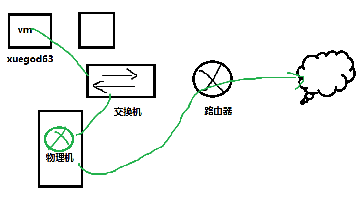

# Linux安装 基本配置

---

## 简介 

`Linux centOS-7-x86_64-DVD-1908.iso`安装后的基本配置

## 版本

0.0.1

## 目录

* [配置防火墙和 SELinux](#firewall)
* [配置静态IP并能够通过 SSH 连接](#ip)
* [更换 yum 源](#yumSource)
* [创建一个普通用户并赋予 root 权限](#root)
* [nginx 安装](#nginxInstall)
* [nginx 配置说明](#nginxConf)
* [nginx 常用命令](#nginxCommand)
* [虚拟机网络使用技巧](#network)

## Linux centOS7安装后的基本操作

### <a id="firewall">配置防火墙和SELinux</a>

```
# 关闭防火墙
systemctl stop firewalld.service
systemctl disable firewalld.service
```

```
# 关闭selinux
sed -i '/SELINUX/s/enforcing/disabled/' /etc/selinux/config
```

```
# 安装依赖软件
yum install -y zsh git
```

```
# 通过以下方式安装
sh -c "$(wget -O- https://raw.githubusercontent.com/robbyrussell/oh-my-zsh/master/tools/install.sh)"
```

```
# 选择主题和插件
vi ~/.zshrc
```

```
# 安装中文man手册
yum install -y man-pages-zh-CN
```

```
# 同步时间
yum  install -y ntpdate 
echo ntpdate -u ntp.api.bz >>/etc/rc.local
```

### <a id="ip">配置静态IP并能够通过SSH连接</a>

> IP: 192.168.2.198  
> 路由器: 192.168.2.1

```
# 在网卡中配置静态IP
vi /etc/sysconfig/network-scripts/ifcfg-eth0
```

```
# 将ONBOOT=no改为yes，保存后重启网络服务即可
service network restart
```

```
# 在网卡中配置如下内容可以设置静态 ip
BOOTPROTO=static # 网卡获取IP的方式(默认为dchp,设置为静态获取。
IPADDR=192.168.2.20 # 除最后部分其他与宿主机的网关一致
GATEWAY=192.168.2.1 # 与宿主机保持一致
NETMASK=255.255.255.0
```

**如果要访问外网还要配置 DNS**

> DNS1=192.168.2.1  
> DNS2=8.8.8.8

```
# 配置完之后保存重启网络
service network restart
```

```
# 通过 SSH 连接
ssh root@192.168.2.20
```

### <a id="yumSource">更换 yum 源</a>

```
# 打开centos的yum文件夹
cd /etc/yum.repos.d/
```

```
# 备份
mv CentOS-Base.repo CentOS-Base.repo.backup
```

**可以下载后更改名称**

```
# 用wget 下载
wget http://mirrors.aliyun.com/repo/Centos-7.repo
```

> 如果wget命令不生效，说明还没有安装wget工具，输入yum -y install wget 回车进行安装。  
> 当前目录是/etc/yum.repos.d/，刚刚下载的Centos-7.repo也在这个目录上

```
# 替换系统原来的repo文件
mv CentOS-7.repo CentOS-Base.repo
```

**也可以下载直接更换名称**

```
wget -O CentOS-Base.repo http://mirrors.aliyun.com/repo/Centos-7.repo
```

```
# 执行yum源更新命令
yum clean all

yum makecache

yum update
```

### <a id="root">创建一个普通用户并赋予 root 权限</a>

```
# 创建普通用户
useradd test
password test 
新的 密码：# 根据提示输入密码
```

```
# 将该用户加入root组
echo 'test ALL=(ALL)ALL'>> /etc/sudoers
tail -1 /etc/sudoers
text ALL=(ALL)ALL
```

### <a id="nginxInstall">nginx安装</a>

```
# 安装Linux系统下的一些辅助工具
yum -y install gcc gcc-c++ autoconf pcre-devel make automake wget httpd-tools vim
```

```
# 查看nginx 版本
yum list | grep nginx
```

```
# 建立nginx源的配置文件
vim /etc/yum.repos.d/nginx.repo
```

```
# 将如下代码修改后放到nginx.repo中并保存退出
[nginx-stable]
name=nginx stable repo
baseurl=http://nginx.org/packages/centos/7/$basearch/
gpgcheck=1
enabled=1
gpgkey=https://nginx.org/keys/nginx_signing.key
```

```
# 再次查看是否有最新稳定版本
yum list |grep nginx
```

```
# 安装nginx
yum install nginx
```

### <a id="nginxConf">nginx配置说明</a>

```
# 查看nginx安装到那里
rpm -ql nginx

# 或者
whereis nginx
```

```
# 查看nginx.conf
cd /etc/nginx
vi nginx.conf
```

```
# 查看 default.conf
cd /etc/nginx/conf.d
vim default.conf
```

### <a id="nginxCommand">nginx 常用命令</a>

```
# nginx 服务运行情况查询
ps aux | grep nginx
```

```
# 启动nginx
sudo systemctl start nginx

# 或者
systemctl start nginx.service
```

```
# 重启nginx
sudo systemctl restart nginx
```

```
# 重新加载，因为一般重新配置之后，不希望重启服务，这时可以使用重新加载
sudo systemctl reload nginx
```

```
# 停止nginx
nginx -s stop # 立即停止服务
nginx -s quit # 从容器中停止服务
killall nginx # 杀死进程
systemctl stop nginx.service # systemctl 停止
```

```
# 查看nginx是否安装成功
nginx -v
```

```
# 查看开启的端口号
netstat -tln
```

```
# 解决nslookup命令找不到
yum install bind-utils -y
```

### <a id="network">虚拟机网络使用技巧</a>

虚拟机为我们提供了三种网络工作模式：Bridged（桥接模式）、NAT（网络地址转换模式）、Host-Only（仅主机模式）

**桥接模式：**就是将主机网卡与虚拟机虚拟的网卡利用虚拟网桥进行通信。

在桥接的作用下，类似于把物理主机虚拟为一个交换机，所有桥接设置的虚拟机连接到这个交换机的一个接口上，物理主机也同样插在这个交换机当中。

虚拟机IP地址需要与主机在同一个网段，如果需要联网，则网关与DNS需要与主机网卡一致。


**NAT(地址转换模式)：**在NAT模式下，虚拟主机需要借助虚拟NAT设备和虚拟DHCP服务器，使得虚拟机可以联网。虚拟机和物理机共有一个IP地址。

> 注：虚拟机使用NAT模式时，Linux系统要配置成动态获取IP。



**Host-Only 模式：** 将虚拟机与外网隔开，使得虚拟机成为一个独立的系统，只与主机相互通讯。相当于NAT模式去除了虚拟NAT地址转换功能。

> 注：虚拟机使用**Host-Only**模式时，Linux系统要配置成动态获取IP

