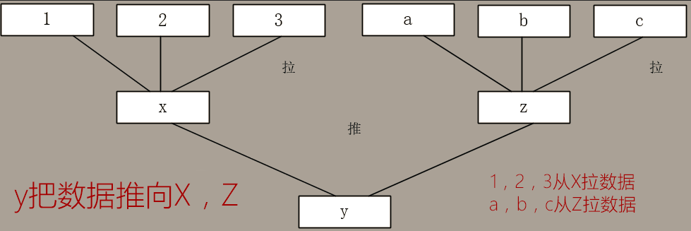
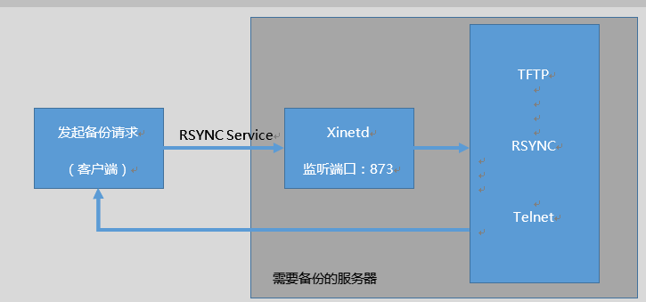
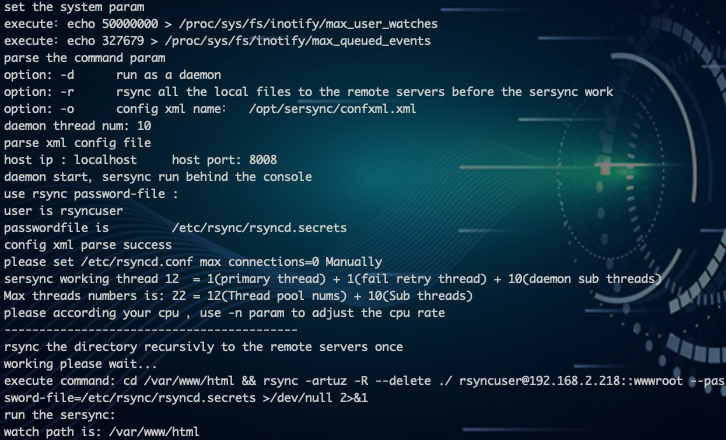

# 第二章：使用rsync实现服务器数据备份

---

## 目录

* [Rsync 概述](#aboutRsync)
* [Rsync 服务安装](#installRsync)
* [Rsync + sersync 实现数据实时同步](#rsyncAndSersync)

## 内容

### <a href="#aboutRsync" id="aboutRsync">RSYNC 概述</a>

Rsync 是 Linux 系统下的数据镜像备份工具，使用快速增量备份工具 Remote Sync 可以远程同步，可以在不同主机之间进行同步，可实现全量备份与增量备份，保持链接和权限，且采用优化的同步算法，传输前执行压缩，因此非常适合用于架构集中式备份或异地备份等应用。同时 Rsync 支持本地复制，或者与其他 SSH、rsync 主机同步。

官方网站：[https://rsync.samba.org/](https://rsync.samba.org/)

#### 1.1 RSYNC 数据备份

与 SCP 的比较：scp 无法备份大量数据，类似 Windows 的复制。  
而 rsync 边复制，边统计，边比较。  

Author： Andrew Tridgell, Wayne Davison, and others  
Andrew Tridgell 是 Samba 项目的领导者和主要开发人员，同时还在参与开发 rsync、Linux Kernel。

```
[root@spring ~]# rsync --version # 查看 rsync 版本，可以看到相关作者相信
rsync  version 3.1.2  protocol version 31
Copyright (C) 1996-2015 by Andrew Tridgell, Wayne Davison, and others.
Web site: http://rsync.samba.org/
Capabilities:
    64-bit files, 64-bit inums, 64-bit timestamps, 64-bit long ints,
    socketpairs, hardlinks, symlinks, IPv6, batchfiles, inplace,
    append, ACLs, xattrs, iconv, symtimes, prealloc

rsync comes with ABSOLUTELY NO WARRANTY.  This is free software, and you
are welcome to redistribute it under certain conditions.  See the GNU
General Public Licence for details.
```

#### 1.2 Rysnc 特性和优点

1. 可以镜像保存整个目录树和文件系统。
2. 可以很容易做到保持原来文件的权限、时间、软硬链接等等。
3. 无须特殊权限即可安装。
4. 快速：第一次同步时 rsync 复制全部内容，但在下一次只传输修改过的文件。
5. 压缩传输：rsync 在传输数据的过程中可以实行压缩及解压缩操作，因此可以使用更少的带宽。
6. 安全：可以使用 scp、ssh 等方式来传输文件。
7. 支持匿名传输，以方便进行网站镜象。
8. 选择性保持：符号连接，硬链接，文件属性，权限，时间等。


* **快速性：**第一次同步时 rsync 会将指定目录下全部内容复制同步，但在下一次只传输修改过的内容。
* **安全性：**可以使用 scp、ssh 等方式来传输文件，当然也可以通过直接的 socket 连接。选择性保持：符号连接，硬链接，文件属性，权限，时间等。
* **压缩传输：**rsync 在传输数据的过程中可以实行压缩及解压缩操作，因此可以使用更少的带宽。

#### 1.3 常见备份分类

* **完整备份**：每次备份都是从备份源将所有的文件或目录备份到目的地。
* **差量备份**：备份上次完全备份以后有变化的数据（他针对的上次的完全备份，他备份过程中不清除存档属性）。
* **增量备份**：备份上次备份以后有变化的数据（他才不管是那种类型的备份，有变化的数据就备份，他会清除存档属性）。

#### 1.4 RSYNC 原理

1. 运行模式和端口：
	1. 采用 C/S 模式（客户端/服务器模式）[ 实际上是一个点到点的传输，直接使用 rsync 命
令即可完成 ] 
	2.  rsync 监听的端口：873
2. 四个名词的解释：
	1. **发起端**：负责发起 rsync 同步操作的客户机叫做发起端，通知服务器我要备份你的数据。
	2. **备份源**：负责响应来自客户机 rsync 同步操作的服务器叫做备份源，需要备份的服务器。
	3. **服务端**：运行 rsyncd 服务，一般来说，需要备份的服务器。
	4. **客户端**：存放备份数据。
3. 数据同步方式：
	* **推 push**：一台主机负责把数据传送给其他主机，服务器开销很大，比较适合后端服务器少的情况。
	* **拉 pull**：所有主机定时去找一台主机拉数据，可能就会导致数据缓慢。
	* **推**：目的主机配置为 rsync 服务器，源主机周期性的使用 rsync 命令把要同步的目录推过去（需要备份的机器是客户端，存储备份的机器是服务端）。
	* **拉**：源主机配置为 rsync 服务器，目的主机周期性的使用 rsync 命令把要同步的目录拉过来（需要备份的机器是服务端，存储备份的机器是客户端）。
	* 两种方案，rsync 都有对应的命令来实现。

rsync 命令示例说明 push 和 pull，如图 2-1 所示



<center>图 2-1 push 和 pull 示意图</center>

xinetd 管理 Rsync 工作原理，如图 2-2 所示



<center>图 2-2 xinetd 管理 Rsync 工作原理</center>

使用 rsync 来同步是先通过 xinetd 监听 873 号端口，如果 rsync 进来的是 873 号端口，那么 xinetd就会通知它所管辖的 rsync 服务来做回应，接下来就是 rsync 俩服务于之间的通讯。

### <a href="#installRsync" id="installRsync">Rsync 服务安装</a>

实验环境：

1. spring(源主机：192.168.2.220)
2. hye(目标主机：192.168.2.218)

由于 rsync 服务依赖 xinetd 服务，是使用超级服务来管理的，因此需要在目标机器上安装 xinetd、rsync 服务端。

```
[root@spring ~]# yum -y install xinetd rsync # 使用 Yum 安装 xinetd、rsync
[root@hye ~]# yum -y install xinetd rsync     # 使用 Yum 安装 xinetd、rsync
[root@hye ~]# rsync --daemon                   # 运行 rsync 为 daemon 模式
[root@hye ~]# netstat -antup | grep 873       # 查看 873 端口是否监听
tcp        0      0 0.0.0.0:873             0.0.0.0:*               LISTEN      1136/rsync
tcp6       0      0 :::873                  :::*                    LISTEN      1136/rsync
```

#### 2.1 rsync 命令选项

1. `-a`：`--archive archive mode` 权限保存模式，相当于 -rlptgoD 参数，存档，递归，保持属性等。
2. `-r`：`--recursive` 复制所有下面的资料，递归处理。
3. `-p`：`--perms` 保留档案权限，文件原有属性。
4. `-t`：`--times` 保留时间点，文件原有时间。
5. `-g`：`--group` 保留原有属组。
6. `-o`：`--owner` 保留档案所有者(root only)。
7. `-D`：`--devices` 保留 device 资讯(root only)。
8. `-l`：`--links` 复制所有的连接，拷贝连接文件。
9. `-z`：`--compress` 压缩模式，当资料在传送到目的端进行档案压缩。
10. `-H`：`--hard-links` 保留硬链接文件。
11. `-A`：`--acls` 保留 ACL 属性文件，需要配合`--perms`。
12. `-P`：`-P` 参数和 `--partial` `--progress` 相同，只是为了把参数简单化，表示传进度。
13. `--version`：输出 rsync 版本。
14. `-v`：`--verbose` 复杂的输出信息。
15. `-u`：`--update` 仅仅进行更新，也就是跳过已经存在的目标位置，并且文件时间要晚于要备份的文件，不覆盖新的文件。
16. `--port=PORT`：定义 rsyncd(daemon)要运行的 port(预设为 tcp 873)。
17. `--delete`：删除那些目标位置有的文件而备份源没有的文件。
18. `--password-file=FILE`：从指定密码文件中获取密码。
19.  `--bwlimit=KBPS`：限制 I/O 带宽。
20. `--filter “-filename”`：需要过滤的文件。
21. `--exclude=filname`：需要过滤的文件。
22. `--progress`：显示备份过程。

<font color="#f00">通常常用的选项 –avz</font>

#### 2.2 使用 rsync 备份数据

对 spring 网站根目录的/var/www/html 目录备份到 hye 的/web-back

1. spring(源主机：192.168.2.220)
2. hye(目标主机：192.168.2.218)

1、建立测试用户（两台主机都需要操作）：

```
[root@hye ~]# useradd hye001 && echo "123456" | passwd --stdin hye001
Changing password for user hye001.
passwd: all authentication tokens updated successfully.
```

```
[root@spring ~]# useradd spring001 && echo '123456' | passwd --stdin spring001
Changing password for user spring001.
passwd: all authentication tokens updated successfully.
```

2、 对目录赋予 ACL 权限

```
[root@spring ~]# mkdir -p /var/www/html/ # 创建目录
[root@spring ~]#
[root@spring ~]# setfacl -R -m user:spring001:rwx /var/www/html/
[root@spring ~]# setfacl -R -m default:spring001:rwx /var/www/html/
[root@spring ~]# getfacl /var/www/html
getfacl: Removing leading '/' from absolute path names
# file: var/www/html
# owner: root
# group: root
user::rwx
user:spring001:rwx
group::r-x
mask::rwx
other::r-x
default:user::rwx
default:user:spring001:rwx
default:group::r-x
default:mask::rwx
default:other::r-x

```

3、 创建测试数据

```
[root@spring ~]# cp -r /boot/* /var/www/html/ # 复制/boot/目录下所有内容到 /var/www/html/目录下
```

4、服务端上操作

```
[root@hye ~]# mkdir /web-back                               # 创建存放数据目录
[root@hye ~]# chown hye001:hye001 -R /web-back/  # 修改目录属主、属组为hye001
[root@hye ~]# rsync -avz /var/www/html/

[root@spring ~]# rsync -avz /var/www/html/ hye001@192.168.2.218:/web-back
hye001@192.168.2.218's password:
sending incremental file list
./
System.map-3.10.0-1062.9.1.el7.x86_64
System.map-3.10.0-1062.el7.x86_64
config-3.10.0-1062.9.1.el7.x86_64
config-3.10.0-1062.el7.x86_64
initramfs-0-rescue-d9a3bf30ef8dad45b3ce714bf7fcaf7e.img
initramfs-3.10.0-1062.9.1.el7.x86_64.img
initramfs-3.10.0-1062.el7.x86_64.img
symvers-3.10.0-1062.9.1.el7.x86_64.gz
symvers-3.10.0-1062.el7.x86_64.gz
vmlinuz-0-rescue-d9a3bf30ef8dad45b3ce714bf7fcaf7e
vmlinuz-3.10.0-1062.9.1.el7.x86_64
vmlinuz-3.10.0-1062.el7.x86_64
efi/
efi/EFI/
efi/EFI/centos/
grub/
grub/splash.xpm.gz
grub2/
grub2/device.map
grub2/grub.cfg
grub2/grubenv
grub2/fonts/
grub2/fonts/unicode.pf2
grub2/i386-pc/
grub2/i386-pc/acpi.mod
grub2/i386-pc/adler32.mod
grub2/i386-pc/affs.mod
grub2/i386-pc/afs.mod
grub2/i386-pc/ahci.mod
grub2/i386-pc/all_video.mod
grub2/i386-pc/aout.mod
grub2/i386-pc/archelp.mod
grub2/i386-pc/at_keyboard.mod
grub2/i386-pc/ata.mod
grub2/i386-pc/backtrace.mod
grub2/i386-pc/bfs.mod
grub2/i386-pc/biosdisk.mod
grub2/i386-pc/bitmap.mod
grub2/i386-pc/bitmap_scale.mod
grub2/i386-pc/blocklist.mod
grub2/i386-pc/blscfg.mod
grub2/i386-pc/boot.img
grub2/i386-pc/boot.mod
grub2/i386-pc/bsd.mod
grub2/i386-pc/btrfs.mod
grub2/i386-pc/bufio.mod
grub2/i386-pc/cat.mod
grub2/i386-pc/cbfs.mod
grub2/i386-pc/cbls.mod
grub2/i386-pc/cbmemc.mod
grub2/i386-pc/cbtable.mod
grub2/i386-pc/cbtime.mod
grub2/i386-pc/chain.mod
grub2/i386-pc/cmdline_cat_test.mod
grub2/i386-pc/cmosdump.mod
grub2/i386-pc/cmostest.mod
grub2/i386-pc/cmp.mod
grub2/i386-pc/command.lst
grub2/i386-pc/configfile.mod
grub2/i386-pc/core.img
grub2/i386-pc/cpio.mod
grub2/i386-pc/cpio_be.mod
grub2/i386-pc/cpuid.mod
grub2/i386-pc/crc64.mod
grub2/i386-pc/crypto.lst
grub2/i386-pc/crypto.mod
grub2/i386-pc/cryptodisk.mod
grub2/i386-pc/cs5536.mod
grub2/i386-pc/date.mod
grub2/i386-pc/datehook.mod
grub2/i386-pc/datetime.mod
grub2/i386-pc/disk.mod
grub2/i386-pc/diskfilter.mod
grub2/i386-pc/div_test.mod
grub2/i386-pc/dm_nv.mod
grub2/i386-pc/drivemap.mod
grub2/i386-pc/echo.mod
grub2/i386-pc/efiemu.mod
grub2/i386-pc/ehci.mod
grub2/i386-pc/elf.mod
grub2/i386-pc/eval.mod
grub2/i386-pc/exfat.mod
grub2/i386-pc/exfctest.mod
grub2/i386-pc/ext2.mod
grub2/i386-pc/extcmd.mod
grub2/i386-pc/fat.mod
grub2/i386-pc/file.mod
grub2/i386-pc/font.mod
grub2/i386-pc/freedos.mod
grub2/i386-pc/fs.lst
grub2/i386-pc/fshelp.mod
grub2/i386-pc/functional_test.mod
grub2/i386-pc/gcry_arcfour.mod
grub2/i386-pc/gcry_blowfish.mod
grub2/i386-pc/gcry_camellia.mod
grub2/i386-pc/gcry_cast5.mod
grub2/i386-pc/gcry_crc.mod
grub2/i386-pc/gcry_des.mod
grub2/i386-pc/gcry_dsa.mod
grub2/i386-pc/gcry_idea.mod
grub2/i386-pc/gcry_md4.mod
grub2/i386-pc/gcry_md5.mod
grub2/i386-pc/gcry_rfc2268.mod
grub2/i386-pc/gcry_rijndael.mod
grub2/i386-pc/gcry_rmd160.mod
grub2/i386-pc/gcry_rsa.mod
grub2/i386-pc/gcry_seed.mod
grub2/i386-pc/gcry_serpent.mod
grub2/i386-pc/gcry_sha1.mod
grub2/i386-pc/gcry_sha256.mod
grub2/i386-pc/gcry_sha512.mod
grub2/i386-pc/gcry_tiger.mod
grub2/i386-pc/gcry_twofish.mod
grub2/i386-pc/gcry_whirlpool.mod
grub2/i386-pc/gdb.mod
grub2/i386-pc/geli.mod
grub2/i386-pc/gettext.mod
grub2/i386-pc/gfxmenu.mod
grub2/i386-pc/gfxterm.mod
grub2/i386-pc/gfxterm_background.mod
grub2/i386-pc/gfxterm_menu.mod
grub2/i386-pc/gptsync.mod
grub2/i386-pc/gzio.mod
grub2/i386-pc/halt.mod
grub2/i386-pc/hashsum.mod
grub2/i386-pc/hdparm.mod
grub2/i386-pc/hello.mod
grub2/i386-pc/help.mod
grub2/i386-pc/hexdump.mod
grub2/i386-pc/hfs.mod
grub2/i386-pc/hfsplus.mod
grub2/i386-pc/hfspluscomp.mod
grub2/i386-pc/http.mod
grub2/i386-pc/iorw.mod
grub2/i386-pc/iso9660.mod
grub2/i386-pc/jfs.mod
grub2/i386-pc/jpeg.mod
grub2/i386-pc/keylayouts.mod
grub2/i386-pc/keystatus.mod
grub2/i386-pc/ldm.mod
grub2/i386-pc/legacy_password_test.mod
grub2/i386-pc/legacycfg.mod
grub2/i386-pc/linux.mod
grub2/i386-pc/linux16.mod
grub2/i386-pc/loadenv.mod
grub2/i386-pc/loopback.mod
grub2/i386-pc/ls.mod
grub2/i386-pc/lsacpi.mod
grub2/i386-pc/lsapm.mod
grub2/i386-pc/lsmmap.mod
grub2/i386-pc/lspci.mod
grub2/i386-pc/luks.mod
grub2/i386-pc/lvm.mod
grub2/i386-pc/lzopio.mod
grub2/i386-pc/macbless.mod
grub2/i386-pc/macho.mod
grub2/i386-pc/mda_text.mod
grub2/i386-pc/mdraid09.mod
grub2/i386-pc/mdraid09_be.mod
grub2/i386-pc/mdraid1x.mod
grub2/i386-pc/memdisk.mod
grub2/i386-pc/memrw.mod
grub2/i386-pc/minicmd.mod
grub2/i386-pc/minix.mod
grub2/i386-pc/minix2.mod
grub2/i386-pc/minix2_be.mod
grub2/i386-pc/minix3.mod
grub2/i386-pc/minix3_be.mod
grub2/i386-pc/minix_be.mod
grub2/i386-pc/mmap.mod
grub2/i386-pc/moddep.lst
grub2/i386-pc/modinfo.sh
grub2/i386-pc/morse.mod
grub2/i386-pc/mpi.mod
grub2/i386-pc/msdospart.mod
grub2/i386-pc/multiboot.mod
grub2/i386-pc/multiboot2.mod
grub2/i386-pc/nativedisk.mod
grub2/i386-pc/net.mod
grub2/i386-pc/newc.mod
grub2/i386-pc/nilfs2.mod
grub2/i386-pc/normal.mod
grub2/i386-pc/ntfs.mod
grub2/i386-pc/ntfscomp.mod
grub2/i386-pc/ntldr.mod
grub2/i386-pc/odc.mod
grub2/i386-pc/offsetio.mod
grub2/i386-pc/ohci.mod
grub2/i386-pc/part_acorn.mod
grub2/i386-pc/part_amiga.mod
grub2/i386-pc/part_apple.mod
grub2/i386-pc/part_bsd.mod
grub2/i386-pc/part_dfly.mod
grub2/i386-pc/part_dvh.mod
grub2/i386-pc/part_gpt.mod
grub2/i386-pc/part_msdos.mod
grub2/i386-pc/part_plan.mod
grub2/i386-pc/part_sun.mod
grub2/i386-pc/part_sunpc.mod
grub2/i386-pc/partmap.lst
grub2/i386-pc/parttool.lst
grub2/i386-pc/parttool.mod
grub2/i386-pc/password.mod
grub2/i386-pc/password_pbkdf2.mod
grub2/i386-pc/pata.mod
grub2/i386-pc/pbkdf2.mod
grub2/i386-pc/pbkdf2_test.mod
grub2/i386-pc/pci.mod
grub2/i386-pc/pcidump.mod
grub2/i386-pc/plan9.mod
grub2/i386-pc/play.mod
grub2/i386-pc/png.mod
grub2/i386-pc/priority_queue.mod
grub2/i386-pc/probe.mod
grub2/i386-pc/procfs.mod
grub2/i386-pc/progress.mod
grub2/i386-pc/pxe.mod
grub2/i386-pc/pxechain.mod
grub2/i386-pc/raid5rec.mod
grub2/i386-pc/raid6rec.mod
grub2/i386-pc/read.mod
grub2/i386-pc/reboot.mod
grub2/i386-pc/regexp.mod
grub2/i386-pc/reiserfs.mod
grub2/i386-pc/relocator.mod
grub2/i386-pc/romfs.mod
grub2/i386-pc/scsi.mod
grub2/i386-pc/search.mod
grub2/i386-pc/search_fs_file.mod
grub2/i386-pc/search_fs_uuid.mod
grub2/i386-pc/search_label.mod
grub2/i386-pc/sendkey.mod
grub2/i386-pc/serial.mod
grub2/i386-pc/setjmp.mod
grub2/i386-pc/setjmp_test.mod
grub2/i386-pc/setpci.mod
grub2/i386-pc/sfs.mod
grub2/i386-pc/signature_test.mod
grub2/i386-pc/sleep.mod
grub2/i386-pc/sleep_test.mod
grub2/i386-pc/spkmodem.mod
grub2/i386-pc/squash4.mod
grub2/i386-pc/syslinuxcfg.mod
grub2/i386-pc/tar.mod
grub2/i386-pc/terminal.lst
grub2/i386-pc/terminal.mod
grub2/i386-pc/terminfo.mod
grub2/i386-pc/test.mod
grub2/i386-pc/test_blockarg.mod
grub2/i386-pc/testload.mod
grub2/i386-pc/testspeed.mod
grub2/i386-pc/tftp.mod
grub2/i386-pc/tga.mod
grub2/i386-pc/time.mod
grub2/i386-pc/tr.mod
grub2/i386-pc/trig.mod
grub2/i386-pc/true.mod
grub2/i386-pc/truecrypt.mod
grub2/i386-pc/udf.mod
grub2/i386-pc/ufs1.mod
grub2/i386-pc/ufs1_be.mod
grub2/i386-pc/ufs2.mod
grub2/i386-pc/uhci.mod
grub2/i386-pc/usb.mod
grub2/i386-pc/usb_keyboard.mod
grub2/i386-pc/usbms.mod
grub2/i386-pc/usbserial_common.mod
grub2/i386-pc/usbserial_ftdi.mod
grub2/i386-pc/usbserial_pl2303.mod
grub2/i386-pc/usbserial_usbdebug.mod
grub2/i386-pc/usbtest.mod
grub2/i386-pc/vbe.mod
grub2/i386-pc/verify.mod
grub2/i386-pc/vga.mod
grub2/i386-pc/vga_text.mod
grub2/i386-pc/video.lst
grub2/i386-pc/video.mod
grub2/i386-pc/video_bochs.mod
grub2/i386-pc/video_cirrus.mod
grub2/i386-pc/video_colors.mod
grub2/i386-pc/video_fb.mod
grub2/i386-pc/videoinfo.mod
grub2/i386-pc/videotest.mod
grub2/i386-pc/videotest_checksum.mod
grub2/i386-pc/xfs.mod
grub2/i386-pc/xnu.mod
grub2/i386-pc/xnu_uuid.mod
grub2/i386-pc/xnu_uuid_test.mod
grub2/i386-pc/xzio.mod
grub2/i386-pc/zfs.mod
grub2/i386-pc/zfscrypt.mod
grub2/i386-pc/zfsinfo.mod
grub2/locale/
grub2/locale/ast.mo
grub2/locale/ca.mo
grub2/locale/da.mo
grub2/locale/de.mo
grub2/locale/de@hebrew.mo
grub2/locale/de_CH.mo
grub2/locale/en@arabic.mo
grub2/locale/en@cyrillic.mo
grub2/locale/en@greek.mo
grub2/locale/en@hebrew.mo
grub2/locale/en@piglatin.mo
grub2/locale/en@quot.mo
grub2/locale/eo.mo
grub2/locale/es.mo
grub2/locale/fi.mo
grub2/locale/fr.mo
grub2/locale/gl.mo
grub2/locale/hu.mo
grub2/locale/id.mo
grub2/locale/it.mo
grub2/locale/ja.mo
grub2/locale/lt.mo
grub2/locale/nl.mo
grub2/locale/pa.mo
grub2/locale/pl.mo
grub2/locale/pt_BR.mo
grub2/locale/ru.mo
grub2/locale/sl.mo
grub2/locale/sv.mo
grub2/locale/tr.mo
grub2/locale/uk.mo
grub2/locale/vi.mo
grub2/locale/zh_CN.mo
grub2/locale/zh_TW.mo

sent 118,745,632 bytes  received 6,128 bytes  7,661,403.87 bytes/sec
total size is 131,088,230  speedup is 1.10
```

<font color="#f00">非默认 ssh 端口同步:</font>

```
[root@spring ~]# rsync -avz /var/www/html -e "ssh -p 2020" hye001@192.168.2.218:/var/web-back/
```

#### 2.3 使用非系统用户备份数据

使用非系统用户进入备份数据，依靠系统中的 `rsync` 配置文件`/etc/rsyncd.conf` 进行备份数据，并创建备份账户，最终把 rsync 以 deamon 方式运行。

1、rsyncd.conf 配置文件分为两部分：`全局参数`、`模块参数`。

* `全局参数`：对 rsync 服务器生效，如果模块参数和全局参数冲突，冲突的地方模块参数最终生效。
* `模块参数`：定义需要通过 rsync 输出的目录定义的参数。


（1）常见的全局参数：

| 参数                     | 说明 |
|:---------------|:----|
| `port`                   | 指定后台程序使用的端口号，默认为 873。 |
| `uid`                    | 该选项指定当该模块传输文件时守护进程应该具有的 uid，配合 gid 选项使用可以确定哪些可以访问怎么样的文件权限，默认值是" nobody"。 |
| `gid`                    | 该选项指定当该模块传输文件时守护进程应该具有的 gid。默认值| 为"nobody"。 |
| `max connections` | 指定该模块的最大并发连接数量以保护服务器，超过限制的连接请求将被告知随后再试。默认值是 0，也就是没有限制。 |
| `lock file`             | 指定支持 max connections 参数的锁文件，默认值是/var/run/rsyncd.lock。 |
| `motd file`            | " motd file"参数用来指定一个消息文件，当客户连接服务器时该文件的内容显示给客户，默认是没有 motd 文件的。 |
| `log file`              | " log file"指定 rsync 的日志文件，而不将日志发送给 syslog。 |
| `pid file`              | 指定 rsync 的 pid 文件，通常指定为“/var/run/rsyncd.pid”，存放进程 ID 的文件位置。 |
| `hosts allow =`     | 单个 IP 地址或网络地址，允许访问的客户机地址。 |


（2） 常见的模块参数  
主要是定义服务器哪个要被同步输出，其格式必须为“ [ 共享模块名 ]” 形式，这个名字就是在 rsync 客户端看到的名字，其实很像 samba 服务器提供的共享名。而服务器真正同步的数据是通过 path 来指定的。

| 参数                     | 说明 |
|:---------------|:----|
| `Comment`           | 给模块指定一个描述，该描述连同模块名在客户连接得到模块列表时显示给客户。默认没有描述定义。 |
| `path`                  | 指定该模块的供备份的目录树路径，该参数是必须指定的。 |
| `read only`           | yes 为只允许下载，no 为可以下载和上传文件到服务器。 |
| `exclude`             | 用来指定多个由空格隔开的多个文件或目录(相对路径)，将其添加到 exclude 列表中。这等同于在客户端命令中使用―exclude 或----filter 来指定某些文件或目录不下载或上传（既不可访问） |
| `exclude from`     | 指定一个包含 exclude 模式的定义的文件名，服务器从该文件中读取 exclude列表定义，每个文件或目录需要占用一行 |
| `include`             | 用来指定不排除符合要求的文件或目录。这等同于在客户端命令中使用--include 来指定模式，结合 include 和 exclude 可以定义复杂的 exclude/include 规则。 |
| `include from`     | 指定一个包含 include 模式的定义的文件名，服务器从该文件中读取include列表定义。 |
| `auth users`        | 该选项指定由空格或逗号分隔的用户名列表，只有这些用户才允许连接该模块。这里的用户和系统用户没有任何关系。如果" auth users"被设置，那么客户端发出对该模块的连接请求以后会被 rsync 请求 challenged 进行验证身份这里使用的 challenge/response 认证协议。用户的名和密码以明文方式存放在" secrets file"选项指定的文件中。默认情况下无需密码就可以连接模块（也就是匿名方式）。 |
| `secrets file`       | 该选项指定一个包含定义用户名:密码对的文件。只有在" auth users"被定义时，该文件才有作用。文件每行包含一个 username:passwd 对。一般来说密码最好不要超过 8个字符。没有默认的 secures file 名，注意：该文件的权限一定要是 600，否则客户端将不能连接服务器。 |
| `hosts allow`      | 指定哪些 IP 的客户允许连接该模块。定义可以是以下形式：<br>单个 IP 地址，例如：<font color="#f00">192.167.0.1</font>，多个 IP 或网段需要用空格隔开。<br>整个网段，例如：<font color="#f00">192.168.0.0/24</font>，也可以书写为 <font color="#f00">192.168.0.0/255.255.255.0</font> <br>“*”则表示所有，默认是允许所有主机连接。 |
| `hosts deny`      | 指定不允许连接 rsync 服务器的机器，可以使用 hosts allow 的定义方式来进行定义。默认是没有 hosts deny 定义。 |
| `list`                | 该选项设定当客户请求可以使用的模块列表时，该模块是否应该被列出。如果设置该选项为 false，可以创建隐藏的模块。默认值是 true。 |
| `timeout`         | 通过该选项可以覆盖客户指定的 IP 超时时间。通过该选项可以确保 rsync 服务器不会永远等待一个崩溃的客户端。超时单位为秒钟，0 表示没有超时定义，这也是默认值。对于匿名 rsync 服务器来说，一个理想的数字是 600。 |

2、用配置文件定义目录输出

1. spring(源主机：192.168.2.220)
2. hye(目标主机：192.168.2.218)

<font color="#f00">注意： # 会出现因注释不兼容的问题而导致推数据时出现报错，配置文件需取消注释或者注释进行换行处理。</font>

```
[root@hye ~]# vim /etc/rsyncd.conf # 文件不存在，需要手动创建
# /etc/rsyncd: configuration file for rsync daemon mode

# See rsyncd.conf man page for more options.

# configuration example:

# uid = nobody
uid = root
# gid = nobody
gid = root
address = 192.168.2.218
port = 873
hosts allow = 192.168.2.1/24
# use chroot = yes
use chroot = yes
# max connections = 4
max connections = 5
# pid file = /var/run/rsyncd.pid
pid file =/var/run/rsyncd.pid
lock file =/var/run/rsync.lock
log file =/var/log/rsyncd.log
motd file =/etc/rsyncd.motd
[wwwroot]
path = /web-back/
comment = used for web-data root
read only = false
list = yes
auth users = rsyncuser
secrets file = /etc/rsync/rsyncd.secrets
# exclude = lost+found/
# transfer logging = yes
# timeout = 900
# ignore nonreadable = yes
# dont compress   = *.gz *.tgz *.zip *.z *.Z *.rpm *.deb *.bz2

# [ftp]
#        path = /home/ftp
#        comment = ftp export area
```

3、创建提示文件和用户密码

```
# 编辑欢迎信息文件
[root@hye ~]# echo "Welcome to Backup Server" > /etc/rsyncd.motd
# 创建并编写密码文件
[root@hye ~]# vim /etc/rsync/rsyncd.secrets
rsyncuser:password123 # 格式为 用户名称：密码

[root@hye ~]# chmod 700 /etc/rsync.passwd # 密码文件权限必须是 700 或 者 600，否则的话身份验证会失效。
```

4、启动服务（启动 rsync 与 xinetd 服务）

```
[root@hye ~]# systemctl start xinetd # 启动 xinetd 服务
[root@hye ~]# systemctl enable xinetd # 将 xinetd 服务加入开机项
[root@hye ~]# rsync --daemon --config=/etc/rsyncd.conf # 加 载配 置文件 rsyncd.conf 启动 rsync 服务
[root@hye ~]# netstat -antup | grep :873
tcp        0      0 0.0.0.0:873             0.0.0.0:*               LISTEN      1136/rsync
tcp6       0      0 :::873                  :::*                    LISTEN      1136/rsync
```

5、 测试

rsync 语法：

```
rsync 选项 用户名@备份源服务器 IP::共享模块名 目标目录
```

```
[root@spring ~]# rsync -avz /var/www/html rsyncuser@192.168.2.218::wwwroot
Welcome to Backup Server

Password: # 输入密码 password123
sending incremental file list

sent 7,578 bytes  received 25 bytes  490.52 bytes/sec
total size is 131,088,230  speedup is 17,241.65
```

6、密码处理：新建一个文件保存好密码，然后在 rsync 命令中使用--password-file 指定此文件即可

```
[root@spring ~]# vim /etc/rsync/rsync.secrets
password123

[root@spring ~]# chmod 600 /etc/rsync/rsync.secrets # 赋予密码文件 600 权限

[root@spring ~]# rsync -avz /var/www/html rsyncuser@192.168.2.218::wwwroot --password-file=/etc/rsync/rsync.secrets
Welcome to Backup Server

sending incremental file list

sent 7,578 bytes  received 25 bytes  15,206.00 bytes/sec
total size is 131,088,230  speedup is 17,241.65
```

#### 2.4 脚本实现定时自动备份

```
[root@spring ~]# vim autobackup.sh
#!/bin/bash
rsync -avz /var/www/html/ rsyncuser@192.168.2.218::wwwroot --password-file=/etc/rsync/rsync.secrets

[root@hye ~]# rm -rf /web-back/

[root@spring ~]# sh autobackup.sh
Welcome to Backup Server

sending incremental file list
html/
html/System.map-3.10.0-1062.9.1.el7.x86_64
html/System.map-3.10.0-1062.el7.x86_64
html/config-3.10.0-1062.9.1.el7.x86_64
html/config-3.10.0-1062.el7.x86_64
html/initramfs-0-rescue-d9a3bf30ef8dad45b3ce714bf7fcaf7e.img
html/initramfs-3.10.0-1062.9.1.el7.x86_64.img
html/initramfs-3.10.0-1062.el7.x86_64.img
html/symvers-3.10.0-1062.9.1.el7.x86_64.gz
html/symvers-3.10.0-1062.el7.x86_64.gz
html/vmlinuz-0-rescue-d9a3bf30ef8dad45b3ce714bf7fcaf7e
html/vmlinuz-3.10.0-1062.9.1.el7.x86_64
html/vmlinuz-3.10.0-1062.el7.x86_64
html/efi/
html/efi/EFI/
html/efi/EFI/centos/
html/grub/
html/grub/splash.xpm.gz
html/grub2/
html/grub2/device.map
html/grub2/grub.cfg
html/grub2/grubenv
html/grub2/fonts/
html/grub2/fonts/unicode.pf2
html/grub2/i386-pc/
html/grub2/i386-pc/acpi.mod
html/grub2/i386-pc/adler32.mod
html/grub2/i386-pc/affs.mod
html/grub2/i386-pc/afs.mod
html/grub2/i386-pc/ahci.mod
html/grub2/i386-pc/all_video.mod
html/grub2/i386-pc/aout.mod
html/grub2/i386-pc/archelp.mod
html/grub2/i386-pc/at_keyboard.mod
html/grub2/i386-pc/ata.mod
html/grub2/i386-pc/backtrace.mod
html/grub2/i386-pc/bfs.mod
html/grub2/i386-pc/biosdisk.mod
html/grub2/i386-pc/bitmap.mod
html/grub2/i386-pc/bitmap_scale.mod
html/grub2/i386-pc/blocklist.mod
html/grub2/i386-pc/blscfg.mod
html/grub2/i386-pc/boot.img
html/grub2/i386-pc/boot.mod
html/grub2/i386-pc/bsd.mod
html/grub2/i386-pc/btrfs.mod
html/grub2/i386-pc/bufio.mod
html/grub2/i386-pc/cat.mod
html/grub2/i386-pc/cbfs.mod
html/grub2/i386-pc/cbls.mod
html/grub2/i386-pc/cbmemc.mod
html/grub2/i386-pc/cbtable.mod
html/grub2/i386-pc/cbtime.mod
html/grub2/i386-pc/chain.mod
html/grub2/i386-pc/cmdline_cat_test.mod
html/grub2/i386-pc/cmosdump.mod
html/grub2/i386-pc/cmostest.mod
html/grub2/i386-pc/cmp.mod
html/grub2/i386-pc/command.lst
html/grub2/i386-pc/configfile.mod
html/grub2/i386-pc/core.img
html/grub2/i386-pc/cpio.mod
html/grub2/i386-pc/cpio_be.mod
html/grub2/i386-pc/cpuid.mod
html/grub2/i386-pc/crc64.mod
html/grub2/i386-pc/crypto.lst
html/grub2/i386-pc/crypto.mod
html/grub2/i386-pc/cryptodisk.mod
html/grub2/i386-pc/cs5536.mod
html/grub2/i386-pc/date.mod
html/grub2/i386-pc/datehook.mod
html/grub2/i386-pc/datetime.mod
html/grub2/i386-pc/disk.mod
html/grub2/i386-pc/diskfilter.mod
html/grub2/i386-pc/div_test.mod
html/grub2/i386-pc/dm_nv.mod
html/grub2/i386-pc/drivemap.mod
html/grub2/i386-pc/echo.mod
html/grub2/i386-pc/efiemu.mod
html/grub2/i386-pc/ehci.mod
html/grub2/i386-pc/elf.mod
html/grub2/i386-pc/eval.mod
html/grub2/i386-pc/exfat.mod
html/grub2/i386-pc/exfctest.mod
html/grub2/i386-pc/ext2.mod
html/grub2/i386-pc/extcmd.mod
html/grub2/i386-pc/fat.mod
html/grub2/i386-pc/file.mod
html/grub2/i386-pc/font.mod
html/grub2/i386-pc/freedos.mod
html/grub2/i386-pc/fs.lst
html/grub2/i386-pc/fshelp.mod
html/grub2/i386-pc/functional_test.mod
html/grub2/i386-pc/gcry_arcfour.mod
html/grub2/i386-pc/gcry_blowfish.mod
html/grub2/i386-pc/gcry_camellia.mod
html/grub2/i386-pc/gcry_cast5.mod
html/grub2/i386-pc/gcry_crc.mod
html/grub2/i386-pc/gcry_des.mod
html/grub2/i386-pc/gcry_dsa.mod
html/grub2/i386-pc/gcry_idea.mod
html/grub2/i386-pc/gcry_md4.mod
html/grub2/i386-pc/gcry_md5.mod
html/grub2/i386-pc/gcry_rfc2268.mod
html/grub2/i386-pc/gcry_rijndael.mod
html/grub2/i386-pc/gcry_rmd160.mod
html/grub2/i386-pc/gcry_rsa.mod
html/grub2/i386-pc/gcry_seed.mod
html/grub2/i386-pc/gcry_serpent.mod
html/grub2/i386-pc/gcry_sha1.mod
html/grub2/i386-pc/gcry_sha256.mod
html/grub2/i386-pc/gcry_sha512.mod
html/grub2/i386-pc/gcry_tiger.mod
html/grub2/i386-pc/gcry_twofish.mod
html/grub2/i386-pc/gcry_whirlpool.mod
html/grub2/i386-pc/gdb.mod
html/grub2/i386-pc/geli.mod
html/grub2/i386-pc/gettext.mod
html/grub2/i386-pc/gfxmenu.mod
html/grub2/i386-pc/gfxterm.mod
html/grub2/i386-pc/gfxterm_background.mod
html/grub2/i386-pc/gfxterm_menu.mod
html/grub2/i386-pc/gptsync.mod
html/grub2/i386-pc/gzio.mod
html/grub2/i386-pc/halt.mod
html/grub2/i386-pc/hashsum.mod
html/grub2/i386-pc/hdparm.mod
html/grub2/i386-pc/hello.mod
html/grub2/i386-pc/help.mod
html/grub2/i386-pc/hexdump.mod
html/grub2/i386-pc/hfs.mod
html/grub2/i386-pc/hfsplus.mod
html/grub2/i386-pc/hfspluscomp.mod
html/grub2/i386-pc/http.mod
html/grub2/i386-pc/iorw.mod
html/grub2/i386-pc/iso9660.mod
html/grub2/i386-pc/jfs.mod
html/grub2/i386-pc/jpeg.mod
html/grub2/i386-pc/keylayouts.mod
html/grub2/i386-pc/keystatus.mod
html/grub2/i386-pc/ldm.mod
html/grub2/i386-pc/legacy_password_test.mod
html/grub2/i386-pc/legacycfg.mod
html/grub2/i386-pc/linux.mod
html/grub2/i386-pc/linux16.mod
html/grub2/i386-pc/loadenv.mod
html/grub2/i386-pc/loopback.mod
html/grub2/i386-pc/ls.mod
html/grub2/i386-pc/lsacpi.mod
html/grub2/i386-pc/lsapm.mod
html/grub2/i386-pc/lsmmap.mod
html/grub2/i386-pc/lspci.mod
html/grub2/i386-pc/luks.mod
html/grub2/i386-pc/lvm.mod
html/grub2/i386-pc/lzopio.mod
html/grub2/i386-pc/macbless.mod
html/grub2/i386-pc/macho.mod
html/grub2/i386-pc/mda_text.mod
html/grub2/i386-pc/mdraid09.mod
html/grub2/i386-pc/mdraid09_be.mod
html/grub2/i386-pc/mdraid1x.mod
html/grub2/i386-pc/memdisk.mod
html/grub2/i386-pc/memrw.mod
html/grub2/i386-pc/minicmd.mod
html/grub2/i386-pc/minix.mod
html/grub2/i386-pc/minix2.mod
html/grub2/i386-pc/minix2_be.mod
html/grub2/i386-pc/minix3.mod
html/grub2/i386-pc/minix3_be.mod
html/grub2/i386-pc/minix_be.mod
html/grub2/i386-pc/mmap.mod
html/grub2/i386-pc/moddep.lst
html/grub2/i386-pc/modinfo.sh
html/grub2/i386-pc/morse.mod
html/grub2/i386-pc/mpi.mod
html/grub2/i386-pc/msdospart.mod
html/grub2/i386-pc/multiboot.mod
html/grub2/i386-pc/multiboot2.mod
html/grub2/i386-pc/nativedisk.mod
html/grub2/i386-pc/net.mod
html/grub2/i386-pc/newc.mod
html/grub2/i386-pc/nilfs2.mod
html/grub2/i386-pc/normal.mod
html/grub2/i386-pc/ntfs.mod
html/grub2/i386-pc/ntfscomp.mod
html/grub2/i386-pc/ntldr.mod
html/grub2/i386-pc/odc.mod
html/grub2/i386-pc/offsetio.mod
html/grub2/i386-pc/ohci.mod
html/grub2/i386-pc/part_acorn.mod
html/grub2/i386-pc/part_amiga.mod
html/grub2/i386-pc/part_apple.mod
html/grub2/i386-pc/part_bsd.mod
html/grub2/i386-pc/part_dfly.mod
html/grub2/i386-pc/part_dvh.mod
html/grub2/i386-pc/part_gpt.mod
html/grub2/i386-pc/part_msdos.mod
html/grub2/i386-pc/part_plan.mod
html/grub2/i386-pc/part_sun.mod
html/grub2/i386-pc/part_sunpc.mod
html/grub2/i386-pc/partmap.lst
html/grub2/i386-pc/parttool.lst
html/grub2/i386-pc/parttool.mod
html/grub2/i386-pc/password.mod
html/grub2/i386-pc/password_pbkdf2.mod
html/grub2/i386-pc/pata.mod
html/grub2/i386-pc/pbkdf2.mod
html/grub2/i386-pc/pbkdf2_test.mod
html/grub2/i386-pc/pci.mod
html/grub2/i386-pc/pcidump.mod
html/grub2/i386-pc/plan9.mod
html/grub2/i386-pc/play.mod
html/grub2/i386-pc/png.mod
html/grub2/i386-pc/priority_queue.mod
html/grub2/i386-pc/probe.mod
html/grub2/i386-pc/procfs.mod
html/grub2/i386-pc/progress.mod
html/grub2/i386-pc/pxe.mod
html/grub2/i386-pc/pxechain.mod
html/grub2/i386-pc/raid5rec.mod
html/grub2/i386-pc/raid6rec.mod
html/grub2/i386-pc/read.mod
html/grub2/i386-pc/reboot.mod
html/grub2/i386-pc/regexp.mod
html/grub2/i386-pc/reiserfs.mod
html/grub2/i386-pc/relocator.mod
html/grub2/i386-pc/romfs.mod
html/grub2/i386-pc/scsi.mod
html/grub2/i386-pc/search.mod
html/grub2/i386-pc/search_fs_file.mod
html/grub2/i386-pc/search_fs_uuid.mod
html/grub2/i386-pc/search_label.mod
html/grub2/i386-pc/sendkey.mod
html/grub2/i386-pc/serial.mod
html/grub2/i386-pc/setjmp.mod
html/grub2/i386-pc/setjmp_test.mod
html/grub2/i386-pc/setpci.mod
html/grub2/i386-pc/sfs.mod
html/grub2/i386-pc/signature_test.mod
html/grub2/i386-pc/sleep.mod
html/grub2/i386-pc/sleep_test.mod
html/grub2/i386-pc/spkmodem.mod
html/grub2/i386-pc/squash4.mod
html/grub2/i386-pc/syslinuxcfg.mod
html/grub2/i386-pc/tar.mod
html/grub2/i386-pc/terminal.lst
html/grub2/i386-pc/terminal.mod
html/grub2/i386-pc/terminfo.mod
html/grub2/i386-pc/test.mod
html/grub2/i386-pc/test_blockarg.mod
html/grub2/i386-pc/testload.mod
html/grub2/i386-pc/testspeed.mod
html/grub2/i386-pc/tftp.mod
html/grub2/i386-pc/tga.mod
html/grub2/i386-pc/time.mod
html/grub2/i386-pc/tr.mod
html/grub2/i386-pc/trig.mod
html/grub2/i386-pc/true.mod
html/grub2/i386-pc/truecrypt.mod
html/grub2/i386-pc/udf.mod
html/grub2/i386-pc/ufs1.mod
html/grub2/i386-pc/ufs1_be.mod
html/grub2/i386-pc/ufs2.mod
html/grub2/i386-pc/uhci.mod
html/grub2/i386-pc/usb.mod
html/grub2/i386-pc/usb_keyboard.mod
html/grub2/i386-pc/usbms.mod
html/grub2/i386-pc/usbserial_common.mod
html/grub2/i386-pc/usbserial_ftdi.mod
html/grub2/i386-pc/usbserial_pl2303.mod
html/grub2/i386-pc/usbserial_usbdebug.mod
html/grub2/i386-pc/usbtest.mod
html/grub2/i386-pc/vbe.mod
html/grub2/i386-pc/verify.mod
html/grub2/i386-pc/vga.mod
html/grub2/i386-pc/vga_text.mod
html/grub2/i386-pc/video.lst
html/grub2/i386-pc/video.mod
html/grub2/i386-pc/video_bochs.mod
html/grub2/i386-pc/video_cirrus.mod
html/grub2/i386-pc/video_colors.mod
html/grub2/i386-pc/video_fb.mod
html/grub2/i386-pc/videoinfo.mod
html/grub2/i386-pc/videotest.mod
html/grub2/i386-pc/videotest_checksum.mod
html/grub2/i386-pc/xfs.mod
html/grub2/i386-pc/xnu.mod
html/grub2/i386-pc/xnu_uuid.mod
html/grub2/i386-pc/xnu_uuid_test.mod
html/grub2/i386-pc/xzio.mod
html/grub2/i386-pc/zfs.mod
html/grub2/i386-pc/zfscrypt.mod
html/grub2/i386-pc/zfsinfo.mod
html/grub2/locale/
html/grub2/locale/ast.mo
html/grub2/locale/ca.mo
html/grub2/locale/da.mo
html/grub2/locale/de.mo
html/grub2/locale/de@hebrew.mo
html/grub2/locale/de_CH.mo
html/grub2/locale/en@arabic.mo
html/grub2/locale/en@cyrillic.mo
html/grub2/locale/en@greek.mo
html/grub2/locale/en@hebrew.mo
html/grub2/locale/en@piglatin.mo
html/grub2/locale/en@quot.mo
html/grub2/locale/eo.mo
html/grub2/locale/es.mo
html/grub2/locale/fi.mo
html/grub2/locale/fr.mo
html/grub2/locale/gl.mo
html/grub2/locale/hu.mo
html/grub2/locale/id.mo
html/grub2/locale/it.mo
html/grub2/locale/ja.mo
html/grub2/locale/lt.mo
html/grub2/locale/nl.mo
html/grub2/locale/pa.mo
html/grub2/locale/pl.mo
html/grub2/locale/pt_BR.mo
html/grub2/locale/ru.mo
html/grub2/locale/sl.mo
html/grub2/locale/sv.mo
html/grub2/locale/tr.mo
html/grub2/locale/uk.mo
html/grub2/locale/vi.mo
html/grub2/locale/zh_CN.mo
html/grub2/locale/zh_TW.mo

sent 118,745,649 bytes  received 6,133 bytes  13,970,797.88 bytes/sec
total size is 131,088,230  speedup is 1.10
```

错误处理：

```
[root@spring ~]# sh autobackup.sh
Welcome to Backup Server

@ERROR: chroot failed # 该错误是客户端路径不存在
rsync error: error starting client-server protocol (code 5) at main.c(1648) [sender=3.1.2]

解决方法：
[root@hye ~]# mkdir /web-back
[root@hye ~]# chown hye001:hye001 -R /web-back/
```

定义计划任务实现定时备份

```
[root@spring ~]# echo "01 3 * * * sh /root/autoback.sh &" >> /var/spool/cron/root
```

### <a href="#rsyncAndSersync" id="rsyncAndSersync">Rsync+sersync 实现数据实时同步</a>

一台装 sersync、一台装 rsync 服务

1. spring(源主机：192.168.2.220)
2. hye(目标主机：192.168.2.218)

1、为什么要用 `rsync`+`sersync` 架构？

1. `sersync` 是基于 `inotify` 开发的，类似于 `inotify-tools` 的工具。
2. `sersync` 可以记录下被监听目录中发生变化的（包括增加、删除、修改）具体某一个文件或者某一个目录的名字，然后使用 `rsync` 同步的时候，只同步发生变化的文件或者目录。

2、`rsync+inotify-tools` 与 r`sync+sersync` 架构的区别？

1. `rsync+inotify-tools`
	1. `inotify` 只能记录下被监听的目录发生了变化（增，删，改）并没有把具体是哪个文件或者哪个目录发生了变化记录下来。
	2. `rsync` 在同步的时候，并不知道具体是哪个文件或目录发生了变化，每次都是对整个目录进行同步，当数据量很大时，整个目录同步非常耗时（`rsync` 要对整个目录遍历查找对比文件），因此效率很低。
2. `rsync+sersync`
	1. `sersync` 可以记录被监听目录中发生变化的（增，删，改）具体某个文件或目录的名字。
	2. `rsync` 在同步时，只同步发生变化的文件或目录（每次发生变化的数据相对整个同步目录数据来说很小，`rsync` 在遍历查找对比文件时，速度很快），因此效率很高。
3. 同步过程：
	1. 在同步服务器上开启 `sersync` 服务，`sersync` 负责监控配置路径中的文件系统事件变化。
	2. 调用 `rsync` 命令把更新的文件同步到目标服务器。
	3. 需要在主服务器配置 `sersync`，在同步目标服务器配置 `rsync server`（注意：是 `rsync` 服务）。
4. 同步过程和原理：
	1. 用户实时的往 `sersync` 服务器上写入更新文件数据。
	2. 此时需要在同步主服务器上配置 `sersync` 服务。
	3. 在另一台服务器开启 `rsync` 守护进程服务，以同步拉取来自 `sersync` 服务器上的数据。
	4. 在另一台服务器开启 `rsync` 守护进程服务，使 `sersync push` 文件过来。

通过 `rsync` 的守护进程服务后可以发现，实际上 `sersync` 就是监控本地的数据写入或更新事件，然后在调用 `rsync` 客户端的命令，将写入或更新事件对应的文件通过 `rsync` 推送到目标服务器，如图 2-3 所示。


<center>图 2-3 同步过程示意图</center>

#### 3.1 下载 sersync

1、在 google code 下载 `sersync` 的可执行文件版本，里面有配置文件与可执行文件

```
https://raw.githubusercontent.com/orangle/sersync/master/release/sersync2.5.4_64bit_binary_stable_final.tar.gz # 有时下载失败，所有要本地留存一份
```

2、上传到服务器 `/opt` 目录下

```
[root@spring ~]# cd /opt/
[root@spring opt]# tar xvf sersync2.5.4_64bit_binary_stable_final.tar.gz
GNU-Linux-x86/
GNU-Linux-x86/sersync2
GNU-Linux-x86/confxml.xml
[root@spring opt]# mv GNU-Linux-x86 sersync # 解压后的文件重命名为 sersync。
[root@spring opt]# cd sersync
[root@spring sersync]# cp confxml.xml confxml.xml.bak # 备份配置文件，便于二次修改
[root@spring sersync]# ls
confxml.xml  confxml.xml.bak  sersync2

# 1、更改优化 sersync 配置文件

[root@spring sersync]# vim confxml.xml # 修改配置文件中的 24--28 行，如下所示

<?xml version="1.0" encoding="ISO-8859-1"?>
<head version="2.5">
    <host hostip="localhost" port="8008"></host>
    <debug start="false"/>
    <fileSystem xfs="false"/>
    <filter start="false">
        <exclude expression="(.*)\.svn"></exclude>
        <exclude expression="(.*)\.gz"></exclude>
        <exclude expression="^info/*"></exclude>
        <exclude expression="^static/*"></exclude>
    </filter>
    <inotify>
        <delete start="true"/>
        <createFolder start="true"/>
        <createFile start="false"/>
        <closeWrite start="true"/>
        <moveFrom start="true"/>
        <moveTo start="true"/>
        <attrib start="false"/>
        <modify start="false"/>
    </inotify>

    <sersync>
        <localpath watch="/var/www/html"> # 本地同步数据目录
            <remote ip="192.168.2.218" name="wwwroot"/> # #rsync 模块名称
            <!--<remote ip="192.168.8.39" name="tongbu"/>-->
            <!--<remote ip="192.168.8.40" name="tongbu"/>-->
        </localpath>
        # 2、修改 31--34 行，认证部分（rsync 密码认证）。
        <rsync>
            <commonParams params="-artuz"/>
            <auth start="true" users="rsyncuser" passwordfile="/etc/rsync/rsyncd.secrets"/>
            <userDefinedPort start="false" port="874"/><!-- port=874 -->
            <timeout start="false" time="100"/><!-- timeout=100 -->
            <ssh start="false"/>
        </rsync>
        <failLog path="/tmp/rsync_fail_log.sh" timeToExecute="60"/><!--default every 60mins execute once-->
        <crontab start="false" schedule="600"><!--600mins-->
            <crontabfilter start="false">
                <exclude expression="*.php"></exclude>
                <exclude expression="info/*"></exclude>
            </crontabfilter>
        </crontab>
        <plugin start="false" name="command"/>
    </sersync>

    <plugin name="command">
        <param prefix="/bin/sh" suffix="" ignoreError="true"/>  <!--prefix /opt/tongbu/mmm.sh suffix-->
        <filter start="false">
            <include expression="(.*)\.php"/>
            <include expression="(.*)\.sh"/>
        </filter>
    </plugin>

    <plugin name="socket">
        <localpath watch="/opt/tongbu">
            <deshost ip="192.168.138.20" port="8009"/>
        </localpath>
    </plugin>
    <plugin name="refreshCDN">
        <localpath watch="/data0/htdocs/cms.xoyo.com/site/">
            <cdninfo domainname="ccms.chinacache.com" port="80" username="xxxx" passwd="xxxx"/>
            <sendurl base="http://pic.xoyo.com/cms"/>
            <regexurl regex="false" match="cms.xoyo.com/site([/a-zA-Z0-9]*).xoyo.com/images"/>
        </localpath>
    </plugin>
</head>
```

3、开启 sersync 守护进程同步数据

```
[root@spring sersync]# /opt/sersync/sersync2 -d -r -o /opt/sersync/confxml.xml
```



<center>图 2-4 开启 sersync 守护进程</center>

4、测试

1. 在 63 `/var/www/html/` 目录 增加、删除、或改目录文件。
2. 看 64 `/web-back` 目录的变化

```
[root@hye web-back]# watch ls -l
```

5、设置 sersync 监控开机自动执行

```
[root@spring html]# vim /etc/rc.d/rc.local # 编辑 rc.local 文件，在最后添加一行。
/opt/sersync/sersync2 -d -r -o /opt/sersync/confxml.xml # 设置开机自动运行脚本
```

6、添加脚本监控 sersync 是否正常运行

```
[root@spring html]# vim /opt/check_sersync.sh # 编辑脚本，添加以下代码
#!/bin/bash
sersync="/opt/sersync/sersync2"
confxml="/opt/sersync/confxml.xml"
status=$(ps aux | grep 'sersync2' | grep -v 'gerp' | wc -l)
if [ $status -eq 0 ]; then
        $sersync -d -r -o $confxml &
else
        exit 0;
fi

[root@spring html]# chmod +x /opt/check_sersync.sh # 添加脚本执行权限
```