# 第十三章：Linux文件系统结构

---

## 目录

* [硬盘结构](#硬盘结构)
* [文件系统结构](#文件系统结构)
* [硬链接和软链接](#硬链接和软链接)
* [实战：解决磁盘有空间但创建不了文件-修复服务器文件系统](#实战)

## 内容

### <a href="#硬盘结构" id="硬盘结构">硬盘结构</a>

**硬盘外部结构**   

硬盘的外部结构主要包括金属固定面板、控制电路板和接口三部分。


**金属固定面板**   

硬盘外部会有一个金属的面板，用于保护整个硬盘。   
金属面板和地板结合成一个密封的整体，保证硬盘盘体和机构的稳定运行。   

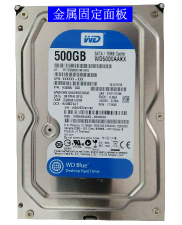

**控制电路板**  

这个电路板是硬盘的控制电路板。该电路板上的电子元器件大多采用贴片式元件焊接，这些电子元器件组成了功能不同的电子电路，这些电路包括主轴调速电路、磁头驱动与伺服定位电路、读写电路、控制与接口电路等。在电路板上有几个主要的芯片：主控芯片、BIOS芯片、缓存芯片、电机驱动芯片。


**接口**  

在硬盘的顶端会有几个不同的硬盘接口，这些接口主要包括电源插座接口、数据接口和主、从跳线接口，其中电源插口与主机电源相联，为硬盘工作提供电力保证。中间的主、从盘跳线接口，用以设置主、从硬盘，即设置硬盘驱动器的访问顺序。

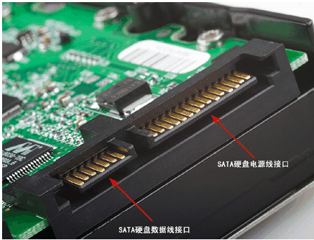

硬盘内部主要包括磁头组件、磁头驱动组件、盘体、主轴组件、前置控制电路等。

**（1） 磁头组件**

磁头组件包括读写磁头、传动手臂、传动轴三部分组成。  
磁头组件中最主要的部分是磁头，另外的两个部分可以看作是磁头的辅助装置。传动轴带动传动臂，使磁头到达指定的位置。  
磁头是硬盘中对盘片进行读写工作的工具，是硬盘中最精密的部位之一。磁头是用线圈缠绕在磁芯上制成的，工作原理则是利用特殊材料的电阻值会随着磁场变化的原理来读写盘片上的数据。硬盘在工作时，磁头通过感应旋转的盘片上磁场的变化来读取数据；通过改变盘片上的磁场来写入数据。为避免磁头和盘片的磨损，在工作状态时，磁头悬浮在高速转动的盘片上方，间隙只有0.1~0.3um，而不是盘片直接接触，在电源关闭之后，磁头会自动回到在盘片上着陆区，此处盘片并不存储数据，是盘片的起始位置，如图，为磁头组件及磁头驱动组件。

**（2） 磁头驱动组件**

磁头的移动是靠磁头驱动组件实现的，硬盘寻道时间的长短与磁头驱动组件关系非常密切。磁头的驱动机构由电磁线圈电机、磁头驱动小车、防震动装置构成，高精度的轻型磁头驱动机构能够对磁头进行正确的驱动和定位，并能在很短时间内精确定位系统指令指定的磁道，保证数据读写的可靠性。电磁线圈电机包含着一块永久磁铁，该磁铁的磁力很强，对于传动手臂的运动起着关键性的作用。防震装置是为了避免磁头将盘片刮伤等情况的发生而设计的。图为磁头驱动组件。

**（3） 盘片与主轴组件**

盘片是硬盘存储数据的载体，盘片是在铝合金或玻璃基底上涂覆很薄的磁性材料、保护材料和润滑材料等多种不同作用的材料层加工而成，其中磁性材料的物理性能和磁层机构直接影响着数据的存储密度和所存储数据的稳定性。金属盘片具有很高的存储密度、高剩磁及高娇顽力；玻璃盘片比普通金属盘片在运行时具有更好的稳定性。如图。为硬盘的盘片和主轴组件。  
主轴组件包括主轴部件轴瓦和驱动电机等。随着硬盘容量的扩大和速度的提高，主轴电机的速度也在不断提升，有厂商开始采用精密机械工业的液态轴承机电技术，这种技术的应用有效地降低了硬盘工作噪音。

**（4） 前置控制电路**

前置放大电路控制磁头感应的信号、主轴电机调速、磁头驱动和伺服定位等，由于磁头读取的信号微弱，将放大电路密封在腔体内可减少外来信号的干扰，提高操作指令的准确性，如图所示硬盘前置控制电路。

**硬盘逻辑结构**  

新买来的硬盘是不能直接使用的，必须对它进行分区进行格式化才能存储数据。经过格式化分区后，逻辑上每个盘片的每一面都会被分为磁道、扇区、柱面这几个虚拟的概念，并非像切豆腐一样真的进行切割。如图所示为硬盘划分的逻辑结构图。另外，不同的硬盘中盘片数不同，一个盘片有两面，这两面都能存储数据，每一面都会对应一个磁头，习惯上将盘面数计为磁头数，用来计算硬盘容量。  
扇区、磁道（或柱面）和磁头数构成了硬盘结构的基本参数，用这些参数计算硬盘的容量，其计算公式为：  
存储容量=磁头数X磁道（柱面）数X每道扇区数X每扇区字节数


**硬盘内部结构**

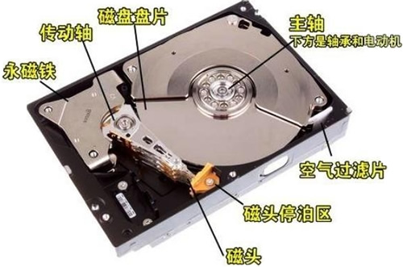

**磁道**

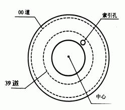

**柱面**

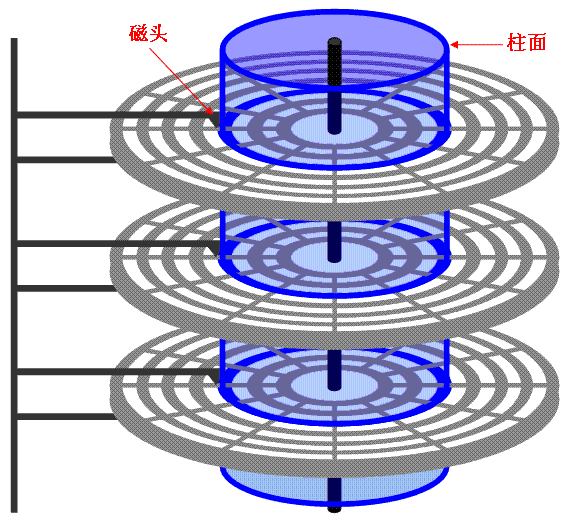

不同种类的硬盘：硬盘的种类比较多，若是按照硬盘接口类型的不同来分，大致可以分为IDE硬盘、SATA硬盘、SCSI硬盘、移动硬盘、固态硬盘。

**1、IDE硬盘**

IDE（Integrated Drive Electronics）硬盘是指采用IDE接口的硬盘。如图，为IDE硬盘。IDE是所有现存并行ATA接口规格的统称。这种硬盘相对来说价格低廉、兼容性强、工作稳定、容量大、噪音低，应用比较多。但是，这种硬盘采用并行数据传输方式，传输速度的不断提升使得信号干扰逐渐变强，不利于数据的传输。

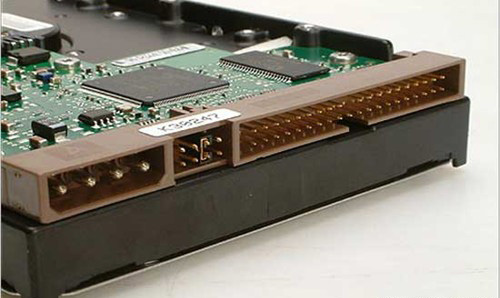

**2、SATA硬盘**

SATA（Serial Advande Technology Attachment）硬盘是指采用SATA接口的硬盘，如图，为SATA硬盘。SATA接口采用串行数据传输方式，理论上传输速度比IDE接口要快很多，解决了IDE硬盘数据传输信号干扰限制传输速率的问题，并且采用该接口的硬盘支持热插拔，执行率也很高。


**3、SCSI硬盘**

SCSI（Small Computer System Interface）硬盘就是采用SCSI接口的硬盘，采用这种接口的硬盘主要用于服务器，如图为SCIS硬盘。这种接口共有50针，外观和普通硬盘接口有些相似。SCSI硬盘和普通IDE硬盘相比有很多优点：接口速度快，并且由于主要用于服务器，因此硬盘本身的性能也比较高，硬盘转速快，缓存容量大，CPU占用率低，扩展性远优于IDE硬盘，并且同样支持热插拔。

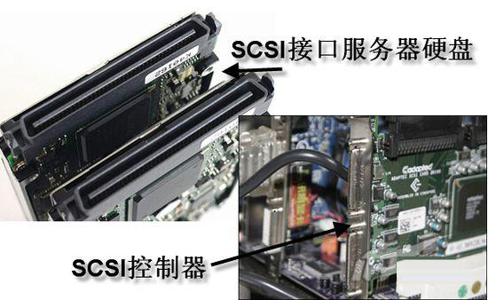

**4、固态硬盘**

固态硬盘（Solid State Disk）用固态电子存储芯片列阵而制成的硬盘，如图，所示为固态硬盘，它主要由控制单元和存储单元（FLASH芯片）组成。固态硬盘的接口规范和定义、功能及使用方法上与普通硬盘的完全相同，在产品外形和尺寸上与普通硬盘几乎一致。固态硬盘的存储介质分为两种，一种是采用闪存（FLASH芯片）作为存储介质，另外一种是采用DRAM作为存储介质。广泛应用于军事、车载、工控、视频监控、网络监控、网络终端、电力、医疗、航空、导航设备等领域。但是，由于固态硬盘的成本比较高，销售价格相对较高，所以还没有得到普及。


现在硬盘都采用这种技术：ZBR（Zoned Bit Recording）区位记录 （Zoned zōnd ）  
Zoned-bit recording（ZBR 区位记录）是一种物理优化硬盘存储空间的方法，此方法通过将更多
的扇区放到磁盘的外部磁道而获取更多存储空间。  
ZBR 磁盘扇区结构示意图  

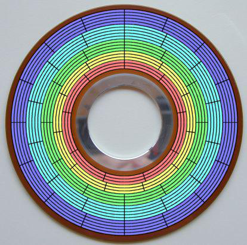

> 互动：使用 ZBR 区位记录法做的磁盘有以下特点：读外圈的数据快，读内圈的数据慢


> 互动：  
> 1. windows ： C 盘安装最外，速度也是最快  
> 2. boot 分区和 swap 分区，装最外面  

**簇和 block**

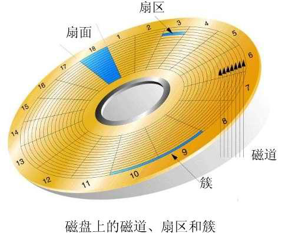

```
[root@spring ~]# stat /etc/passwd
  File: /etc/passwd
  Size: 1142      	Blocks: 8          IO Block: 4096   regular file # IO 块：4096 =4KB 普通文件
Device: 803h/2051d	Inode: 17116773    Links: 1
Access: (0644/-rw-r--r--)  Uid: (    0/    root)   Gid: (    0/    root)
Access: 2020-02-05 13:54:29.160999808 +0800
Modify: 2020-01-31 22:18:26.124000000 +0800
Change: 2020-01-31 22:18:26.149000000 +0800
 Birth: -
```

### <a href="#文件系统结构" id="文件系统结构">文件系统结构</a>

* Linux 文件系统由三部分组成：文件名、inode、block
* Linux 文件系统：ext3、ext4、xfs
* Windows文件系统：FAT32、NTFS

**1、文件名**

```
[root@spring ~]# cp /etc/passwd passwd.txt
[root@spring ~]# ls passwd.txt
passwd.txt # 文件名
```

**2、inode 的内容**

inode包含文件的元信息，具体由以下内容：

1. 文件的字节数
2. 文件拥有者的 User ID
3. 文件的Group ID
4. 文件的读、写、执行权限
5. 文件的时间戳：
	1. ctime（change time）指inode上一次变动的时间
	2. mtime（modify time）指文件内容上一次变动时间
	3. atime（access time）指文件上一次打开的时间
6. 链接数，即有多少文件名指向这个inode
7. 文件数据block的位置

用`stat`查看某个文件的inode信息

```
[root@spring ~]# stat passwd.txt
  File: passwd.txt
  Size: 1142      	Blocks: 8          IO Block: 4096   regular file
Device: 803h/2051d	Inode: 33742866    Links: 1
Access: (0644/-rw-r--r--)  Uid: (    0/    root)   Gid: (    0/    root)
Access: 2020-02-05 16:08:40.048669658 +0800
Modify: 2020-02-05 16:08:40.048669658 +0800
Change: 2020-02-05 16:08:40.048669658 +0800
 Birth: -
```

```
[root@spring ~]# ll passwd.txt # 其实就是查看passwd.txt的inode信息
-rw-r--r-- 1 root root 1142 Feb  5 16:08 passwd.txt # ll查看到时间是ctime时间
```

```
[root@spring ~]# touch a.txt
[root@spring ~]# date -s '12:32'
Wed Feb  5 12:32:00 CST 2020
[root@spring ~]# vim a.txt
[root@spring ~]# stat a.txt
  File: ‘a.txt’
  Size: 19        	Blocks: 8          IO Block: 4096   regular file
Device: 803h/2051d	Inode: 16819927    Links: 1
Access: (0644/-rw-r--r--)  Uid: (    0/    root)   Gid: (    0/    root)
Access: 2020-02-05 12:32:25.215000000 +0800
Modify: 2020-02-05 12:32:25.215000000 +0800
Change: 2020-02-05 12:32:25.219000000 +0800
 Birth: -
```

**3、inode的大小**

inode也会消耗硬盘空间，所以硬盘格式化的时候，操作系统自动将硬盘分成两个区域。一个是数据区、存放文件数据；另一个是inode区（inode table），存放inode所包含的信息。

每个inode节点的大小，一般是128字节或256字节。inode节点的总数，在格式化时就给定，假定在一块1GB的硬盘中，每个inode节点的大小为128字节，每1KB就设置一个inode，那么inode table的大小就会达到128MB，占整块硬盘的12.8%。

inode号码：每个inode都有一个号码，操作系统用inode号码来识别不同的文件。

Uninx/Linux 系统内部不使用文件名，而使用inode号码来识别文件。对于系统来说，文件名只是inode号码便于识别的别名或者绰号。表面上，用户通过文件名打开文件。实际上，系统内部的这个过程分成三步：首先，系统找到这个文件名对应的inode号码；其次，通过inode号码，获取inode信息；最后，根据inode信息，找到文件数据所在的block，读出数据。

```
[root@spring ~]# ls -i a.txt # 使用ls -i 命令，可以看到文件名对应的inode号码
16819927 a.txt
```

<font color="#f00">查看每个硬盘分区的inode总数和已经使用的数量，可以使用`df`命令</font>

```
[root@spring ~]# df -i
Filesystem      Inodes IUsed   IFree IUse% Mounted on
devtmpfs        124195   347  123848    1% /dev
tmpfs           126851     1  126850    1% /dev/shm
tmpfs           126851   439  126412    1% /run
tmpfs           126851    16  126835    1% /sys/fs/cgroup
/dev/sda3      5242880 41388 5201492    1% /
/dev/sr0             0     0       0     - /mnt
/dev/sda1       256000   332  255668    1% /boot
tmpfs           126851     1  126850    1% /run/user/0
```

> 注意：由于每个文件都必须有一个inode，因此有可能发生inode已经用光，但是硬盘还未存满的情况。这时，就无法在硬盘上创建新文件。

**4、目录文件**

Unix/Linux系统中，目录（directory）也是一种文件。打开目录，实际上就是打开目录文件。

目录文件的结构非常简单，就是一系列目录项的列表。每个目录项，由两部分组成：所包含文件的文件名，以及该文件名对应的inode号码。

```
[root@spring ~]# ls -i /
     113 bin   16867624 home       1856 mnt       7104 run    8388680 tmp
      64 boot       117 lib     8389717 opt        118 sbin  16867571 usr
       3 dev         82 lib64         1 proc  16867625 srv   25165889 var
 8388673 etc   25166242 media  16797761 root         1 sys
```

**5、block块大小**

* block是真正存储数据的地方
* block是文件系统中最小的存储单位
* 扇区是磁盘中最小的存储单位

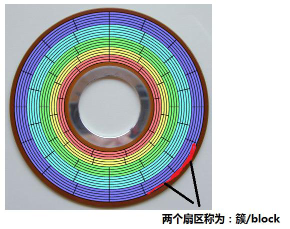

在Linux下为：block；在Windows下为：簇

> 问：为什么要有block，直接使用扇区可以吗？  
> 答：操作系统读取硬盘的时候，不会一个个扇区（512字节）的读取，这样效率太低，而是一次性连续读取多个扇区，即一次性读取一个“块”（block）。这种由多个扇区组成的“块”，是文件存取的最小单位。“块”的大小，最常见的是1KB，即连2个sector扇区组成的一个block。或4K。

```
[root@spring ~]# stat /etc/passwd | grep IO
  Size: 856       	Blocks: 8          IO Block: 4096   regular file # block 到是 4K
```

总结：

硬盘的结构：ZBR区位记录

* inode（inode表主要看inode号）
* inode号唯一标识一个文件（一个文件系统里）
* inode用完了，文件就不能创建
* inode数据量设置大一些：可以创建多个文件，占用空间比较大
* inode数据量设置小一些：可以创建很少文件，占用空间比较小

block

* block设置大：效率高，利用率低
* block设置小：效率低，利用率高

### <a href="#硬链接和软链接" id="硬链接和软链接">文件的硬链接和软链接</a>

**1、Linux链接概念**

Linux链接分两种，一种被称为硬链接（Hard link），另一种被称为软链接，即符号链接（Symbolic Link）  
默认情况下，ln命令产生硬链接。

* 硬链接：指通过索引节点号来进行连接。inode是可以对应多个文件名的。

在Linux的文件系统中，保存在磁盘分区中的文件不管是什么类型都给它分配一个编号，称为索引节点号（Inode Index）。

在Linux中，多个文件名可以指向同一索引节点。一般这种连接就是硬链接。

<font color="#f00">硬链接的作用是允许一个文件拥有多个有效路径名，这样用户就可以建立硬链接到重要文件，以防止“误删”的功能</font>

只删除一个连接并不影响索引节点本身和其他的连接，只有当最后一个连接被删除后，文件的数据块及目录的连接才会被释放。也就是说，文件真正删除的条件是与之相关的所有硬件连接文件均被删除。

* 软链接：另外一种链接称为符号链接（Symbolic Link），也叫软链接。软链接文件有类似于Windows的快捷方式。它实际上是一个特殊的文件。在符号链接中，文件实际上是一个文本文件，其中包含的有另一文件的位置信息。

```
[root@spring ~]# ln a.txt b.txt
[root@spring ~]# ll
total 12
-rw-------. 1 root root 1453 Jan 31 18:07 anaconda-ks.cfg
-rw-r--r--  2 root root   19 Feb  5 12:32 a.txt
-rw-r--r--  2 root root   19 Feb  5 12:32 b.txt
[root@spring ~]# ll b.txt
-rw-r--r-- 2 root root 19 Feb  5 12:32 b.txt
[root@spring ~]# echo 111 >> a.txt
[root@spring ~]# cat a.txt
1
2
12
3
1
2
3
123
111
[root@spring ~]# cat b.txt
1
2
12
3
1
2
3
123
111
```

```
[root@spring ~]# ls -i a.txt
16819927 a.txt
[root@spring ~]# ls -i b.txt
16819927 b.txt
```

```
[root@spring ~]# chmod 777 a.txt
[root@spring ~]# ll a.txt
-rwxrwxrwx 2 root root 23 Feb  5 18:33 a.txt
[root@spring ~]# ll b.txt
-rwxrwxrwx 2 root root 23 Feb  5 18:33 b.txt
```

硬链接的原理就是多个文件名指向同一个inode，因此多个文件名共用一个inode号，达到共享与备份的目的。

> 注意：原文件被删除，不影响链接文件的正常使用

```
[root@spring ~]# rm -rf a.txt
[root@spring ~]# ll
total 8
-rw-------. 1 root root 1453 Jan 31 18:07 anaconda-ks.cfg
-rwxrwxrwx  1 root root   23 Feb  5 18:33 b.txt
[root@spring ~]# ll b.txt
-rwxrwxrwx 1 root root 23 Feb  5 18:33 b.txt
```

```
[root@spring ~]# echo 000 >> b.txt
[root@spring ~]# cat b.txt
1
2
12
3
1
2
3
123
111
000
```

**硬链接不能针对目录创建**

```
[root@spring ~]# ln /etc/ test
ln: ‘/etc/’: hard link not allowed for directory
```

**硬链接不能跨分区进行创建**

```
[root@spring ~]# ln b.txt /mnt/bb.txt
ln: failed to create hard link ‘/mnt/bb.txt’: Read-only file system
```

硬链接的特点：无法针对目录，跨分区实现。因为每个分区都有自己独立的INODE号

> 问：为什么刚创建的一个目录，链接数就是2？  
> 答：默认新建一个空目录，此目录的第二个字段就是2（包含两个隐藏目录，因为每一个目录都有一个指向他本身的字目录“.”和指向它上级目录的子目录“..”），所以test是一个链接，隐藏目录"."是第二个链接。

```
[root@spring ~]# mkdir test
[root@spring ~]# ll -id test/
16819928 drwxr-xr-x 2 root root 6 Feb  5 18:45 test/
[root@spring ~]# ll -id test/.
16819928 drwxr-xr-x 2 root root 6 Feb  5 18:45 test/.
```

ln -s 创建软链接

```
[root@spring ~]# cp /etc/passwd a.txt
[root@spring ~]# ln -s a.txt a-link.txt
[root@spring ~]# ll
total 12
lrwxrwxrwx  1 root root    5 Feb  5 19:05 a-link.txt -> a.txt
-rw-------. 1 root root 1453 Jan 31 18:07 anaconda-ks.cfg
-rw-r--r--  1 root root  856 Feb  5 19:05 a.txt
-rwxrwxrwx  1 root root   27 Feb  5 18:37 b.txt
drwxr-xr-x  2 root root    6 Feb  5 18:45 test
[root@spring ~]# rm -rf a.txt
[root@spring ~]# ll a-link.txt
lrwxrwxrwx 1 root root 5 Feb  5 19:05 a-link.txt -> a.txt 
[root@spring ~]# cat a-link.txt
cat: a-link.txt: No such file or directory
```

> 注：源文件被删除，链接文件失效

能针对目录和跨分区创建软链接(源文件必须写绝对路径)

```
[root@spring ~]# ln -s /boot/grub grub-link
[root@spring ~]# ll
total 8
lrwxrwxrwx  1 root root    5 Feb  5 19:05 a-link.txt -> a.txt
-rw-------. 1 root root 1453 Jan 31 18:07 anaconda-ks.cfg
-rwxrwxrwx  1 root root   27 Feb  5 18:37 b.txt
lrwxrwxrwx  1 root root   10 Feb  5 19:18 grub-link -> /boot/grub
drwxr-xr-x  2 root root    6 Feb  5 18:45 test
```

```
[root@spring ~]# cd /boot/
[root@spring boot]# ln -s ./grub /root/aaa
[root@spring boot]# ll /root/aaa
lrwxrwxrwx 1 root root 6 Feb  5 19:20 /root/aaa -> ./grub # 报错了
```

**4、inode的特殊作用**

由于inode号码与文件分离，这种机制导致了一些Unix/Linux系统特有的现象。

1. 有时文件名包含特殊符号，无法正常删除。这时直接删除inode节点，就能起到删除文件的作用。
2. 移动文件或重命名文件，只是改变文件名，不影响inode号码。
3. 打开一个文件以后，系统就以inode号码来识别这个文件，不再考虑文件名。因此，通常说，系统无法从inode号码得知文件名。

> 问：为什么每次修改完服务器配置文件，都需要重新加载一下配置文件？  
> 答：因为vim每次修改完后，inode号都会变

```
[root@spring ~]# cp /etc/passwd passwd
[root@spring ~]# ls -i passwd
16819927 passwd
[root@spring ~]# vim passwd
[root@spring ~]# ls -i passwd
16819929 passwd
```

### <a href="#实战" id="实战">实战：解决磁盘有空间但创建不了文件-修复服务器文件系统]</a>

**1、解决磁盘有空间单创建不了文件**

* 解决方案 1：删除/data/cache 目录中的部分文件，释放出/data 分区的一部分 inode。
* 解决方案 2 : 在/data 备份好一些文件，然后删除这些文件，释放一些 inode，然后创建一个文件夹/data/cache2。在 cache2 下挂载一个新分区： sda4 ，下次写数据需要写到新分区 cache2 目录下。

inode 分区完后，可以增加吗？ 不可以。 inode 总数是在格式化时定下来。

```
[root@spring ~]# mkfs.ext4 -I 500000000000 /dev/sda1 #可以指定大小
参数：
[-i bytes-per-inode] [-I inode-size]
```

实战：修复服务器文件系统

司服务器突然断电后，再次启动后，报如下错误

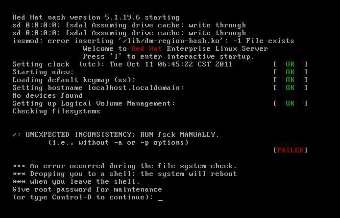

解决方法：
输入 root 密码

```
[root@spring ~]# fsck -f -y /dev/sda1 #把引导分区文件系统修复一下 # 慎用，给领导说一声
[root@spring ~]# fsck -f -y /dev/sda3 #把根分区文件系统修复一下 # 慎用，给领导说一声
```
reboot 重启
fsck 参数：

* -y 对所有问题都回答 "yes"
* -f 即使文件系统标记为 clean 也强制进行检查