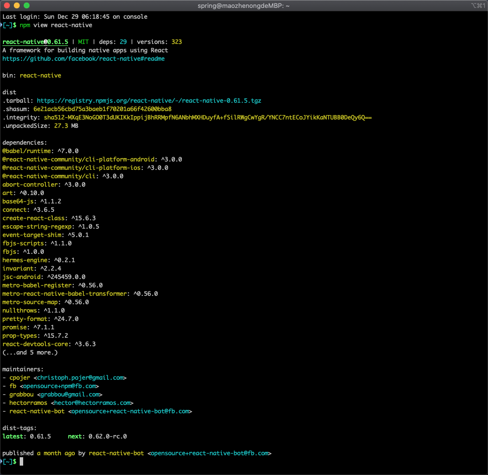
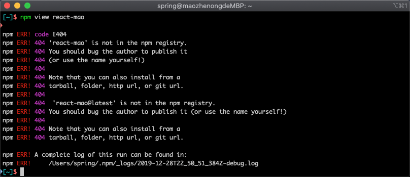

# package.json

---

在`Node.js`中，模块是一个库或框架，也是一个`Node.js`项目。`Node.js`项目遵循模块化的架构，当我们创建了一个`Node.js`项目，意味着创建了一个模块，这个模块必须有一个描述文件，即`package.json`。配置一个合理的`package.json`文件直接决定着我们项目的质量。

## 必备属性

`package.json`中有非常多的属性，其中必须填写的只有两个`name`和`version`，这两个属性组成一个`npm`模块的唯一标识。

`npm`包命名规则

`name`即模块名称，其命名时需要遵循官方的一些规范和建议：

* 包名会成为模块`url`、命令行中的一个参数或者一个文件夹名称，任何非url安全的字符在包名中都不能使用，可以使用`validate-npm-package-name`包来检测包名是否合法。
* 语义化包名，可以帮助开发者更快的找到需要的包名，并且避免意外获取错误的包
* 若包名称中国呢存在一些符号，将符号去除后不得与现有包名重复
	+ 例如：由于`react-native`已经存在，`react.native`、`reactnative`都不可以再创建
* 如果你的包名与现有包名太相近导致你不能发布这个包，那么推荐将这个包发布到你的作用域下
	+ 例如：用户名`conard`,那么作用域为`@conard`，发布的包可以是`@conard/react`

**查看包是否被占用**

`name`是一个包的唯一标识，不得和其他包名重复，我们可以执行`npm view packageName`查看包是否被占用，并可以查看它的一些基本信息:



若包名从未被使用，则抛出`404`错误：



另外[https://www.npmjs.com/](https://www.npmjs.com/)查询更多详细的包信息

## 描述信息

**基本描述**：

```json
{
	"description": "An enterprise-class UI design language and React components implementation",
	"keywords": [
		"ant",
		"component",
		"components",
		"design",
		"framework",
		"frontend",
		"react",
		"react-component",
		"ui"
	]
}
```

`description`用于添加模块的描述信息，方便别人了解你的模块

`keywords`用于给你的模块添加关键字

## 开发人员

描述开发人员的字段有两个：`author` 和 `contributors`， `author` 指包的主要作者，一个 `author` 对应一个人。`contributors` 指贡献者信息，一个 `contributors` 对应多个贡献者，值为数组，对人的描述可以是一个字符串，也可以是下面的结构：

```
{
	"name": "maozhenzhong",
	"email": "maozhenzhong2008@163.com",
	"url": "https://github.com/maozhenzhong"
}
```

## 地址

```
{
	"homepage": "http://ant.design/",
	"bugs": {
		"url": "https://github.com/ant-desing/ant-design/issues"
	},
	"repository": {
		"type": "git",
		"url": "https://github.com/ant-design/ant-design"
	}
}
```

`homepage` 用于指定该模块的主页。

`repository` 用于指定模块的代码仓库。

`bugs` 指定一个地址或者一个邮箱，对你的模块存在疑问的人可以到这里提出问题。

## 依赖配置

我们的项目可能依赖一个或多个外部依赖包，根据依赖包的不同用途，我们将他们配置在下面几个属性下：`dependencies`、`devDependencies`、`peerDependencies`、`bundledDependencies`、`optionalDependencies`。

**配置规则**

* 依赖配置遵循下面几种配置规则：
	+ 依赖包名称:`VERSION`
		- `VERSION`是一个遵循`SemVer`规范的版本号配置，`npm install` 时将到`npm`服务器下载符合指定版本范围的包。
* 依赖包名称:`DWONLOAD_URL`
	+ `DWONLOAD_URL` 是一个可下载的tarball压缩包地址，模块安装时会将这个`.tar`下载并安装到本地。
* 依赖包名称:`LOCAL_PATH`
	+ `LOCAL_PATH` 是一个本地的依赖包路径，例如 `file:../pacakges/pkgName`。适用于你在本地测试一个`npm`包，不应该将这种方法应用于线上。
* 依赖包名称:`GITHUB_URL`
	+ `GITHUB_URL` 即 `github` 的 `username/modulename` 的写法，例如：`ant-design/ant-design`，你还可以在后面指定 `tag` 和 `commit id`。
* 依赖包名称:`GIT_URL`
	+ `GIT_URL` 即我们平时`clone`代码库的 `git url`，其遵循以下形式：

```
<protocol>://[<user>[:<password>]@]<hostname>[:<port>][:][/]<path>[#<commit-ish> | #semver:<semver>]
```

其中 `protocal` 可以是以下几种形式：

* `git://github.com/user/project.git#commit-ish`
* `git+ssh://user@hostname:project.git#commit-ish`
* `git+ssh://user@hostname/project.git#commit-ish`
* `git+http://user@hostname/project/blah.git#commit-ish`
* `git+https://user@hostname/project/blah.git#commit-ish`

**dependencies**

`dependencies` 指定了项目运行所依赖的模块，开发环境和生产环境的依赖模块都可以配置到这里，例如

```
"dependencies": {
      "lodash": "^4.17.13",
      "moment": "^2.24.0",
}
 ```
 
**devDependencies**

有一些包有可能你只是在开发环境中用到，例如你用于检测代码规范的`eslint`,用于进行测试的`jest`，用户使用你的包时即使不安装这些依赖也可以正常运行，反而安装他们会耗费更多的时间和资源，所以你可以把这些依赖添加到 `devDependencies` 中，这些依赖照样会在你本地进行 `npm install` 时被安装和管理，但是不会被安装到生产环境：

```
"devDependencies": {
	"jest": "^24.3.1",
	"eslint": "^6.1.0"
}
```

**peerDependencies**

`peerDependencies` 用于指定你正在开发的模块所依赖的版本以及用户安装的依赖包版本的兼容性。

上面的说法可能有点太抽象，我们直接拿 `ant-design` 来举个例子，`ant-design` 的 `package.json` 中有如下配置：

```
"peerDependencies": {
	"react": ">=16.0.0",
	"react-dom": ">=16.0.0"
}
```

当你正在开发一个系统，使用了 `ant-design` ，所以也肯定需要依赖 `React`。同时， `ant-design` 也是需要依赖 `React` 的，它要保持稳定运行所需要的 `React` 版本是`16.0.0`，而你开发时依赖的 `React` 版本是 15.x：

这时，`ant-design` 要使用 `React`，并将其引入：

```
import * as React from 'react';
import * as ReactDOM from 'react-dom';
```

这时取到的是宿主环境也就是你的环境中的 `React` 版本，这就可能造成一些问题。在 `npm2` 的时候，指定上面的 `peerDependencies` 将意味着强制宿主环境安装 `react@>=16.0.0和react-dom@>=16.0.0` 的版本。

`npm3` 以后不会再要求 `peerDependencies` 所指定的依赖包被强制安装，相反 `npm3` 会在安装结束后检查本次安装是否正确，如果不正确会给用户打印警告提示。

```
"dependencies": {
	"react": "15.6.0",
	"antd": "^3.22.0"
}
```

**optionalDependencies**

某些场景下，依赖包可能不是强依赖的，这个依赖包的功能可有可无，当这个依赖包无法被获取到时，你希望 `npm install` 继续运行，而不会导致失败，你可以将这个依赖放到 `optionalDependencies` 中，注意 `optionalDependencies` 中的配置将会覆盖掉 `dependencies` 所以只需在一个地方进行配置。

当然，引用 `optionalDependencies` 中安装的依赖时，一定要做好异常处理，否则在模块获取不到时会导致报错。

**bundledDependencies**

和以上几个不同，`bundledDependencies` 的值是一个数组，数组里可以指定一些模块，这些模块将在这个包发布时被一起打包。

```
"bundledDependencies": ["package1" , "package2"]
```

## 协议

`license` 字段用于指定软件的开源协议，开源协议里面详尽表述了其他人获得你代码后拥有的权利，可以对你的的代码进行何种操作，何种操作又是被禁止的。同一款协议有很多变种，协议太宽松会导致作者丧失对作品的很多权利，太严格又不便于使用者使用及作品的传播，所以开源作者要考虑自己对作品想保留哪些权利，放开哪些限制。

```
{
	"license": "MIT" 
}
```

> 软件协议可分为开源和商业两类，对于商业协议，或者叫法律声明、许可协议，每个软件会有自己的一套行文，由软件作者或专门律师撰写，对于大多数人来说不必自己花时间和精力去写繁长的许可协议，选择一份广为流传的开源协议就是个不错的选择。

* `MIT`：只要用户在项目副本中包含了版权声明和许可声明，他们就可以拿你的代码做任何想做的事情，你也无需承担任何责任。
* `Apache`：类似于 `MIT`，同时还包含了贡献者向用户提供专利授权相关的条款。
* `GPL`：修改项目代码的用户再次分发源码或二进制代码时，必须公布他的相关修改。

如果你对开源协议有更详细的要求，可以到 [https://choosealicense.com/](https://choosealicense.com/)获取更详细的开源协议说明。

## 目录、文件相关

**程序入口**

```
{
	"main": "lib/index.js"
}
```

`main` 属性可以指定程序的主入口文件，例如，上面 `antd` 指定的模块入口 `lib/index.js`，当我们在代码用引入 `antd` 时：`import { notification } from 'antd'`; 实际上引入的就是 `lib/index.js` 中暴露出去的模块。

**命令行工具入口**

当你的模块是一个命令行工具时，你需要为命令行工具指定一个入口，即指定你的命令名称和本地可指定文件的对应关系。如果是全局安装，npm 将会使用符号链接把可执行文件链接到 `/usr/local/bin`，如果是本地安装，会链接到 `./node_modules/.bin/`。

```
{
	"bin": {
		"conard": "./bin/index.js"
	}
}
```

例如上面的配置：当你的包安装到全局时：`npm` 会在 `/usr/local/bin`下创建一个以 `conard` 为名字的软链接，指向全局安装下来的 conard 包下面的 `"./bin/index.js"`。这时你在命令行执行 `conard` 则会调用链接到的这个`js`文件。

**发布文件配置**

```
{
	"files": [
		"dist",
		"lib",
		"es"
	]
}
```

`files` 属性用于描述你 `npm publish` 后推送到 `npm` 服务器的文件列表，如果指定文件夹，则文件夹内的所有内容都会包含进来。

> 另外，你还可以通过配置一个`.npmignore` 文件来排除一些文件, 防止大量的垃圾文件推送到 `npm`, 规则上和你用的 `.gitignore` 是一样的。`.gitignore` 文件也可以充当`.npmignore` 文件。

**man**

`man` 命令是 `Linux` 下的帮助指令，通过 `man` 指令可以查看 `Linux` 中的指令帮助、配置文件帮助和编程帮助等信息。

如果你的 `node.js` 模块是一个全局的命令行工具，在 `package.json` 通过 `man`  属性可以指定 `man` 命令查找的文档地址。

`man` 文件必须以数字结尾，或者如果被压缩了，以 `.gz` 结尾。数字表示文件将被安装到 `man` 的哪个部分。如果 `man` 文件名称不是以模块名称开头的，安装的时候会给加上模块名称前缀。

```
{
	"man" : [
		"/Users/isaacs/dev/npm/cli/man/man1/npm-access.1",
		"/Users/isaacs/dev/npm/cli/man/man1/npm-audit.1"
	]
}
```

**规范项目目录**

一个 `node.js` 模块是基于 `CommonJS` 模块化规范实现的，严格按照 `CommonJS` 规范，模块目录下除了必须包含包描述文件 `package.json` 以外，还需要包含以下目录：

* `bin`：存放可执行二进制文件的目录
* `lib`：存放js代码的目录
* `doc`：存放文档的目录
* `test`：存放单元测试用例代码的目录

在模块目录中你可能没有严格按照以上结构组织或命名，你可以通过在 `package.json` 指定 `directories` 属性来指定你的目录结构和上述的规范结构的对应情况。除此之外 `directories` 属性暂时没有其他应用

```
{
	"directories": {
		"lib": "src/lib/",
		"bin": "src/bin/",
		"man": "src/man/",
		"doc": "src/doc/",
		"example": "src/example/"
	}
}
```

## 脚本配置

```
{
	"scripts": {
		"test": "jest --config .jest.js --no-cache",
		"dist": "antd-tools run dist",
		"compile": "antd-tools run compile",
		"build": "npm run compile && npm run dist"
	}
}
```

`scripts` 用于配置一些脚本命令的缩写，各个脚本可以互相组合使用，这些脚本可以覆盖整个项目的生命周期，配置后可使用` npm run command `进行调用。如果是 `npm` 关键字，则可以直接调用。例如，上面的配置制定了以下几个命令：`npm run test`、`npm run dist`、`npm run compile`、`npm run build`。

**config**

`config` 字段用于配置脚本中使用的环境变量，例如下面的配置，可以在脚本中使用`process.env.npm_package_config_port`进行获取。

```
{
	"config" : { "port" : "8080" }
}
```

## 发布配置

**preferGlobal**

如果你的 `node.js` 模块主要用于安装到全局的命令行工具，那么该值设置为 `true` ，当用户将该模块安装到本地时，将得到一个警告。这个配置并不会阻止用户安装，而是会提示用户防止错误使用而引发一些问题。

**private**

如果将 `private` 属性设置为 `true`，`npm`将拒绝发布它，这是为了防止一个私有模块被无意间发布出去。

**publishConfig**

```
"publishConfig": {
	"registry": "https://registry.npmjs.org/"
},
```

发布模块时更详细的配置，例如你可以配置只发布某个 `tag`、配置发布到的私有 `npm` 源。更详细的配置可以参考 `npm-config`

**os**

假如你开发了一个模块，只能跑在 darwin 系统下，你需要保证 windows 用户不会安装到你的模块，从而避免发生不必要的错误。

使用 os 属性可以帮助你完成以上的需求，你可以指定你的模块只能被安装在某些系统下，或者指定一个不能安装的系统黑名单：

```
"os" : [ "darwin", "linux" ]
"os" : [ "!win32" ]
```

**cpu**

和上面的 `os` 类似，我们可以用 `cpu` 属性更精准的限制用户安装环境：

```
"cpu" : [ "x64", "ia32" ]
"cpu" : [ "!arm", "!mips" ]
```


